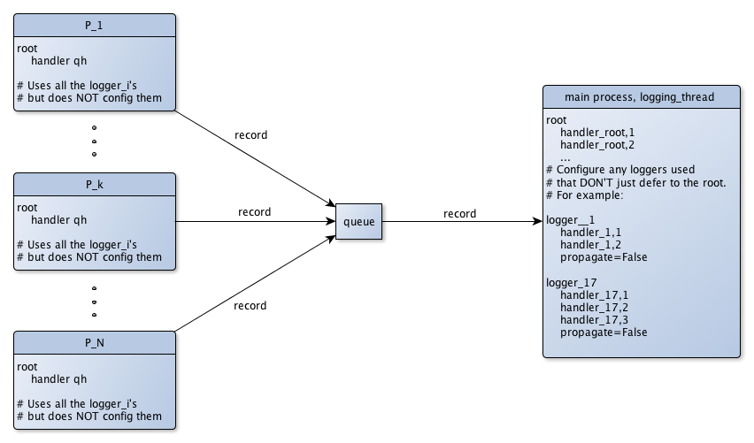
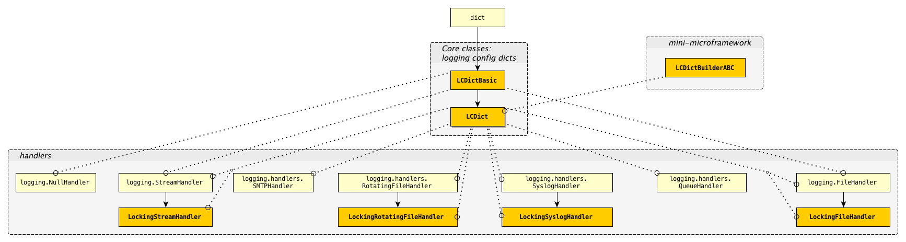

README for `prelogging` |release|
=================================

See the full documentation at `https://pythonhosted.org/prelogging/ <https://pythonhosted.org/prelogging/>`_.

What `prelogging` is and does
------------------------------------------------

`prelogging` is a package for setting up, or *configuring*, the
logging facility of the Python standard library. To *configure logging* is to
specify the logging entities you wish to create — formatters, handlers, optional
filters, and loggers — as well as which of them use which others.

Once configured, logging messages with the `logging` facility is simple and
powerful; configuration presents the only challenge. `logging` provides a couple
of approaches to configuration — static, using a dict or an analogous YAML text
file; and dynamic, using the `logging` API — both of which have their shortcomings.

`prelogging` offers a hybrid approach: a streamlined, consistent API for
incrementally constructing a dict used to configure logging statically.
As you build the configuration dict, by default `prelogging` checks for possible
mistakes and issues warnings on encountering them. `prelogging` also supplies
missing functionality: it provides multiprocessing-safe logging to the console,
to files and rotating files, and to `syslog`.

Requirements
---------------

The `prelogging` package requires only Python 3.4+ or 2.7. It has no external
dependencies.

Very little of `prelogging`\'s code varies between Python versions. We've used
`six` sparingly (one decorator, one function, and one constant) to unify the
few differences. The `prelogging` package includes a copy of the ``six.py``
module (v1.10.0, for what it's worth), so no separate installation is required.

The `prelogging` distribution contains an ``examples/`` subdirectory. A few
examples (``mproc_deco*.py``) use the `deco <https://github.com/alex-sherman/deco>`_
package, which provides a "simplified parallel computing model for Python".
However, the examples are just for illustration (and code coverage), and aren't
installed with the `prelogging` package.

The distribution also contains subdirectories ``tests/`` and ``docs/``, which
similarly are not installed.

Installation
---------------

You can install `prelogging` from PyPI (the Python Package Index) using ``pip``::

    $ pip install prelogging

(Here and elsewhere, ``$`` at the beginning of a line indicates your command
prompt, whatever that may be.)

Alternately, you can

* clone the github repo, or
* download a ``.zip`` or ``.tar.gz`` archive of the repository
  from github or PyPI, and uncompress it

to a fresh directory, ``cd`` to that directory, and run::

    $ python setup.py install

Downloading and uncompressing the archive lets you review, run and/or copy the
tests and examples, which aren't installed by ``pip`` or ``setup.py``. Whichever
method you choose to install `prelogging`, ideally you'll do it in a virtual
environment.

Running tests and examples
----------------------------

The top-level directory of the `prelogging` repository contains three scripts —
``run_tests.py``, ``run_examples.py`` and ``run_all.py`` — which let you run
all tests, all examples, or both, from the top-level directory. You can run
these before installing `prelogging`. To run individual examples, first CD into
their subdirectory, as in this example::

    $ cd examples/
    $ python root_logger.py

.. note::
    On \*nix systems, including macOS, ``setup.py``, the ``run_*.py`` scripts
    and the examples are all executable and have proper
    `shebang <https://en.wikipedia.org/wiki/Shebang_(Unix)>`_\s, so for example
    you can use the command ``./root_logger.py`` instead of
    ``python root_logger.py``.

Coverage from tests + examples
+++++++++++++++++++++++++++++++++++

A few short passages, mostly Python-version-specific code, keep `prelogging` shy
of 100% coverage when both tests and examples are run:

+----------------------------+--------+-------+
|| Module                    || Py 3  || Py 2 |
+============================+========+=======+
|| ``lcdictbasic.py``        || \99%  || 100% |
|| ``lcdict.py``             || \98%  || \96% |
|| ``locking_handlers.py``   || 100%  || 100% |
|| ``lcdict_builder_abc.py`` || 100%  || 100% |
+----------------------------+--------+-------+

-------------------------------------------------------------------------------

Quick start
------------

.. todo:: BLAH BLAH quick start BLAH BLAH

.. BACKGROUND / REVIEW section:

Overview of Logging
-------------------------

Logging is an important part of a program's internal operations, an essential
tool for development, debugging, troubleshooting, performance-tuning and
general maintenance. A program *logs messages* in order to record
its successive states, and to report any anomalies, unexpected situations or
errors, together with enough context to aid diagnosis. Messages can be logged
to multiple destinations at once — ``stderr`` in a terminal, a local file,
the system log, email, or a Unix log server over TCP, to cite common choices.

It's not our purpose to rehash or repeat the extensive (and generally quite
good) documentation for Python's `logging` package; in fact, we presuppose that
you're familiar with basic concepts and standard use cases. Nevertheless, it
will be helpful to review several topics.

Using `logging`
+++++++++++++++++++++++++++++++++++++++++

A program logs messages using the ``log`` method of objects called *loggers*,
which are implemented in `logging` by the ``Logger`` class. You can think of
the ``log`` method as a pumped-up ``print`` statement. It writes a message,
tagged with a level of severity, to one or more destinations.
In `logging`, a ``Handler`` object — a *handler* — represents a single
destination, together with a specified output format.
A handler implements abstract methods which format message data into structured
text and write or transmit that text to the output.
A logger contains zero or more handlers.
When a program logs a message by calling a logger's ``log`` method (or a
shorthand method such as ``debug`` or ``warning``), the logger dispatches the
message data to its handlers.

All messages have a `logging level`, or `loglevel`, indicating their severity
or importance. The predefined levels in ``logging`` are ``DEBUG``, ``INFO``,
``WARNING``, ``ERROR``, ``CRITICAL``, listed in order of increasing severity.
Both loggers and handlers have an associated *loglevel*, indicating a
severity threshold: a logger or a handler will filter out any message whose
loglevel is less than its own. In order for a message to actually be written
to a particular destination, its loglevel must equal or exceed the loglevels
of both the logger and the handler representing the destination.

This allows developers to dial in different amounts of logging verbosity:
you might set a logger's level to ``DEBUG`` in development but to
``ERROR`` in production. There's no need to delete or comment out
the lines of code that log messages, or to precede each such block with a
conditional guard. The logging facility is a very sophisticated version
of using the `print` statement for debugging.

`logging` classes that can be configured
+++++++++++++++++++++++++++++++++++++++++

`logging` defines a few types of entities, culminating in the ``Logger``
class. In general, a program or library will set up, or *configure*, logging
only once, at startup. This entails specifying message formats, destinations,
loggers, and containment relations between those things. Once a program has
configured logging as desired, use of loggers is very straightforward.
Configuration, then, is the only barrier to entry.

The following diagram displays the types that can be configured statically,
and their dependencies:

.. index:: diagram: The objects of `logging` configuration

.. _logging-config-classes:

.. figure:: ../docs/logging_classes_v2.png

    The objects of `logging` configuration

    +-------------------------------+-----------------------+
    | Symbol                        | Meaning               |
    +===============================+=======================+
    | .. image:: ../docs/arrowO.png | has zero or more      |
    +-------------------------------+-----------------------+
    | m: 0/1                        | many-to-(zero-or-one) |
    +-------------------------------+-----------------------+
    | m: n                          | many-to-many          |
    +-------------------------------+-----------------------+

In words:

    * a ``Logger`` can have one or more ``Handler``\s, and a ``Handler``
      can be used by multiple ``Logger``\s;
    * a ``Handler`` has at most one ``Formatter``, but a ``Formatter``
      can be shared by multiple ``Handler``\s;
    * ``Handler``\s and ``Logger``\s can each have zero or more ``Filter``\s;
      a ``Filter`` can be used by multiple ``Handler``\s and/or ``Logger``\s.

What these objects do
~~~~~~~~~~~~~~~~~~~~~~~~~~~~~~

A ``Formatter`` is basically just a format string that uses keywords
defined by the `logging` module — for example, ``'%(message)s'`` and
``'%(name)-20s: %(levelname)-8s: %(message)s'``.

A ``Handler`` formats and writes formatted logged messages to a particular
destination — a stream (e.g. ``sys.stderr``, ``sys.stdout``, or an in-memory
stream such as an ``io.StringIO()``), a file, a rotating set of files, a socket,
etc. A handler without a formatter behaves as if it had a ``'%(message)s'``
formatter.

A ``Logger`` sends logged messages to its associated handlers. Various
criteria filter out which messages are actually written, notably loglevel
thresholding as described above.

``Filter``\s provide still more fine-grained control over which messages are
written.

Logging configuration — with `logging`, with `prelogging`
------------------------------------------------------------------------------

.. todo:: blah

Multiprocessing-safe logging, two ways
-----------------------------------------

* using "locking handlers", simple subclasses of `logging` handlers
  which `prelogging` provides natively << TODO -- more about this >>
* using a QueueHandler and a logging thread,
    - as explained in the docs
    - as shown in an example, ``mproc_approach__queue_handler_logging_thread.py``
    - as depicted in the following diagram

    Multiprocess logging with a queue and a logging thread

-------------------------------------------------------------------------------

.. stuff to include:

-------------------------------------------------------------------------------

`prelogging` classes and their superclasses
------------------------------------------------

.. include:: ../docs/_global.rst

.. _prelogging-all-classes:

    |br| **prelogging** classes — inheritance, and who uses whom

    +-------------------------------+-----------------------+
    | Symbol                        | Meaning               |
    +===============================+=======================+
    | .. image:: ../docs/arrsup.png | is a superclass of    |
    +-------------------------------+-----------------------+
    | .. image:: ../docs/arruse.png | uses (instantiates)   |
    +-------------------------------+-----------------------+

-------------------------------------------------------------------------------

.. _config-abc:

Using ``LCDictBuilderABC``
-------------------------------

A single ``LCDict`` can be passed around to different "areas"
of a program, each area contributing specifications of its desired formatters,
filters, handlers and loggers. The ``LCDictBuilderABC`` class provides a
micro-framework that automates this approach: each area of a program need only
define an ``LCDictBuilderABC`` subclass and override its method
``add_to_lcdict(lcd)``, where it contributes its specifications by calling
methods on ``lcd``.

The `LCDictBuilderABC <https://pythonhosted.org/prelogging/LCDictBuilderABC.html>`_
documentation describes how that class and its two methods operate. The test
``tests/test_lcd_builder.py`` illustrates using the class to configure logging
across multiple modules.

.. _migration:

Migrating a project that uses static dict-based configuration to `prelogging`
++++++++++++++++++++++++++++++++++++++++++++++++++++++++++++++++++++++++++++++

A common pattern for a large program that uses static dict-based configuration
is to pass around a single (logging config) dict to each "area" of the program;
each "area" adds its own required entities and possibly modifies those already
added; finally a top-level routine passes the dict to ``logging.config.dictConfig``.

Let's suppose that each program "area" modifies the logging config dict in
a function called ``add_to_config_dict(d: dict)``. These ``add_to_config_dict``
functions performs dict operations on the parameter ``d`` such as

    ``d['handlers']['another_formatter'] = { ... }``

and

    ``d.update( ... )``.

*Assuming your* ``add_to_config_dict`` *functions use "duck typing" and work
on any parameter* ``d`` *such that* ``isinstance(d, dict)`` *is true, they
should continue to work properly if you pass them an* LCDict.

Thus, the ``add_to_config_dict`` function specific to each
program area can easily be converted to an ``add_to_lcdict(cls, lcd: LCDict)``
classmethod of an ``LCDictBuilderABC`` subclass specific to that program area.

---------------------------------------------------------------------------

.. todo::
    (watch this space)
