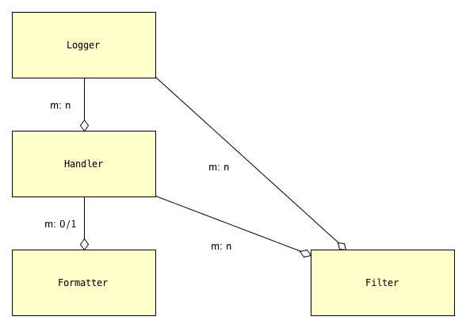

README for `prelogging` |release|
=================================

See the full documentation at `https://pythonhosted.org/prelogging/ <https://pythonhosted.org/prelogging/>`_.

What `prelogging` is and does
------------------------------------------------

`prelogging` is a package for setting up, or *configuring*, the
logging facility of the Python standard library. To *configure logging* is to
specify the logging entities you wish to create — formatters, handlers, optional
filters, and loggers — as well as which of them use which others.

Once configured, logging messages with the `logging` facility is simple and
powerful; configuration presents the only challenge. `logging` provides a couple
of approaches to configuration — static, using a dict or an analogous YAML text
file; and dynamic, using the `logging` API — both of which have their shortcomings.

`prelogging` offers a hybrid approach: a streamlined, consistent API for
incrementally constructing a dict used to configure logging statically.
As you build the configuration dict, by default `prelogging` checks for possible
mistakes and issues warnings on encountering them. `prelogging` also supplies
missing functionality: it provides multiprocessing-safe logging to the console,
to files and rotating files, and to `syslog`.

Requirements
---------------

The `prelogging` package requires only Python 3.4+ or 2.7. It has no external
dependencies.

Very little of `prelogging`\'s code is sensitive to Python 3 vs 2.
To achieve backwards compatibility with 2.7 we had to sacrifice, with great
reluctance, type annotations and keyword-only parameters. To address the
few remaining differences, we've used `six` sparingly (one decorator, one
function, and one constant). The `prelogging` package includes a copy of the ``six.py``
module (v1.10.0, for what it's worth), so no separate installation is required.

The `prelogging` distribution contains an ``examples/`` subdirectory. A few
examples (``mproc_deco*.py``) use the `deco <https://github.com/alex-sherman/deco>`_
package, which provides a "simplified parallel computing model for Python".
However, the examples are just for illustration (and code coverage), and aren't
installed with the `prelogging` package.

The distribution also contains subdirectories ``tests/`` and ``docs/``, which
similarly are not installed.

Installation
---------------

You can install `prelogging` from PyPI (the Python Package Index) using ``pip``::

    $ pip install prelogging

(Here and elsewhere, ``$`` at the beginning of a line indicates your command
prompt, whatever that may be.)

Alternately, you can

* clone the github repo, or
* download a ``.zip`` or ``.tar.gz`` archive of the repository
  from github or PyPI, and uncompress it

to a fresh directory, ``cd`` to that directory, and run::

    $ python setup.py install

Downloading and uncompressing the archive lets you review, run and/or copy the
tests and examples, which aren't installed by ``pip`` or ``setup.py``. Whichever
method you choose to install `prelogging`, ideally you'll do it in a virtual
environment.

Running tests and examples
----------------------------

.. sidebar:: All these scripts are executable on \*nix

    On Unix systems, including macOS, ``setup.py``, the ``run_*.py`` scripts
    and the examples are all executable and have proper
    `shebang <https://en.wikipedia.org/wiki/Shebang_(Unix)>`_\s, so for example
    you can use the command ``./root_logger.py`` instead of
    ``python root_logger.py``.

The top-level directory of the `prelogging` repository contains three scripts —
``run_tests.py``, ``run_examples.py`` and ``run_all.py`` — which let you run
all tests, all examples, or both, from the top-level directory. You can run
these before installing `prelogging`.

To run individual examples, first CD into their subdirectory, as in this example::

    $ cd examples/
    $ python root_logger.py

The `Guide to Examples <https://pythonhosted.org/prelogging/guide-to-examples.html>`_
in the full documentation catalogs all the examples and briefly
describes each one.

Coverage from tests + examples
+++++++++++++++++++++++++++++++++++

A few short passages, mostly Python-version-specific code, keep `prelogging` shy
of 100% coverage when both tests and examples are run:

+----------------------------+--------+-------+
|| Module                    || Py 3  || Py 2 |
+============================+========+=======+
|| ``lcdictbasic.py``        || \99%  || 100% |
|| ``lcdict.py``             || \98%  || \96% |
|| ``locking_handlers.py``   || 100%  || 100% |
|| ``lcdict_builder_abc.py`` || 100%  || 100% |
+----------------------------+--------+-------+

-------------------------------------------------------------------------------

Quick start
------------

.. todo:: BLAH BLAH quick start BLAH BLAH

.. BACKGROUND / REVIEW section:

Overview of logging
-------------------------

Logging is an important part of a program's internal operations, an essential
tool for development, debugging, troubleshooting, performance-tuning and
general maintenance. A program *logs messages* in order to record
its successive states, and to report any anomalies, unexpected situations or
errors, together with enough context to aid diagnosis. Messages can be logged
to multiple destinations at once — ``stderr`` in a terminal, a local file,
the system log, email, or a Unix log server over TCP, to cite common choices.

It's not our purpose to rehash or repeat the extensive (and generally quite
good) documentation for Python's `logging` package; in fact, we presuppose that
you're familiar with basic concepts and standard use cases. Nevertheless, it
will be helpful to review several topics.

Using `logging`
+++++++++++++++++++++++++++++++++++++++++

A program logs messages using the ``log`` method of objects called *loggers*,
which are implemented in `logging` by the ``Logger`` class. You can think of
the ``log`` method as a pumped-up ``print`` statement. It writes a message,
tagged with a level of severity, to zero or more destinations.
In `logging`, a ``Handler`` object — a *handler* — represents a single
destination, together with a specified output format.
A handler implements abstract methods which format message data into structured
text and write or transmit that text to the output.
A logger contains zero or more handlers.
When a program logs a message by calling a logger's ``log`` method (or a
shorthand method such as ``debug`` or ``warning``), the logger dispatches the
message data to its handlers.

All messages have a `logging level`, or `loglevel`, indicating their severity
or importance. The predefined levels in ``logging`` are ``DEBUG``, ``INFO``,
``WARNING``, ``ERROR``, ``CRITICAL``, listed in order of increasing severity.
Both loggers and handlers have an associated *loglevel*, indicating a
severity threshold: a logger or a handler will filter out any message whose
loglevel is less than its own. In order for a message to actually be written
to a particular destination, its loglevel must equal or exceed the loglevels
of both the logger and the handler representing the destination.

.. sidebar:: Sensible choices for dedicated loggers

    The logger named ``'__name__'`` is the standard choice for a module's
    dedicated logger; the logger named ``'__package__'`` is a great choice for
    a package. Without any configuration, these will just write message text to
    ``stderr``.

This elegant system allows developers to easily dial in different amounts
of logging verbosity. When developing a module or package, you can use a
dedicated logger to log internal messages at thoughtfully chosen loglevels.
In development, set the logger's loglevel to ``DEBUG`` or ``INFO`` as needed;
once the module/package is in good condition, raise that to ``WARNING``; in
production, use ``ERROR``. There's no need to delete or comment out the lines
of code that log messages, or to precede each such block with a conditional guard.
The logging facility is a very sophisticated version of using the `print`
statement for debugging.

`logging` classes that can be configured
+++++++++++++++++++++++++++++++++++++++++

`logging` defines a few types of entities, culminating in the ``Logger``
class. In general, a program or library will set up, or *configure*, logging
only once, at startup. This entails specifying message formats, destinations,
loggers, and containment relations between those things. Once a program has
configured logging as desired, use of loggers is very straightforward.
Configuration, then, is the only barrier to entry.

The following diagram displays the types that can be configured statically,
and their dependencies:

.. index:: diagram: The objects of `logging` configuration

.. _logging-config-classes:

    The objects of `logging` configuration

    +-------------------------------+-----------------------+
    | Symbol                        | Meaning               |
    +===============================+=======================+
    | .. image:: ../docs/arrowO.png | has zero or more      |
    +-------------------------------+-----------------------+
    | m: 0/1                        | many-to-(zero-or-one) |
    +-------------------------------+-----------------------+
    | m: n                          | many-to-many          |
    +-------------------------------+-----------------------+

In words:

    * a ``Logger`` can have one or more ``Handler``\s, and a ``Handler``
      can be used by multiple ``Logger``\s;
    * a ``Handler`` has at most one ``Formatter``, but a ``Formatter``
      can be shared by multiple ``Handler``\s;
    * ``Handler``\s and ``Logger``\s can each have zero or more ``Filter``\s;
      a ``Filter`` can be used by multiple ``Handler``\s and/or ``Logger``\s.

What these objects do
~~~~~~~~~~~~~~~~~~~~~~~~~~~~~~

.. sidebar:: Keywords that can appear in formatters

    Here's
    `the complete list of them <https://docs.python.org/3/library/logging.html?highlight=logging#logrecord-attributes>`_.

A ``Formatter`` is basically just a format string that uses keywords
defined by the `logging` module — for example, ``'%(message)s'`` and
``'%(name)-20s: %(levelname)-8s: %(message)s'``.

A ``Handler`` formats and writes logged messages to a particular
destination — a stream (e.g. ``sys.stderr``, ``sys.stdout``, or an in-memory
stream such as an ``io.StringIO()``), a file, a rotating set of files, a socket,
etc. A handler without a formatter behaves as if it had a ``'%(message)s'``
formatter.

A ``Logger`` sends logged messages to its associated handlers. Various
criteria filter out which messages are actually written, notably loglevel
thresholding as described above.

``Filter``\s provide still more fine-grained control over which messages are
written.

Logging configuration — with `logging`, with `prelogging`
------------------------------------------------------------------------------

.. todo:: <<<<<<<<<<<<<<<< TODO >>>>>>>>>>>>>>>>

We'll use a simple example to discuss and compare various approaches to logging
configuration — using the facilities provided by the `logging` package, and then
using `prelogging`.

Logging configuration requirements — example use case
+++++++++++++++++++++++++++++++++++++++++++++++++++++++++

Suppose we want the following configuration:

.. _example-overview-config:

    **Configuration requirements**

    Messages should be logged to both ``stderr`` and a file. Only messages with
    loglevel ``INFO`` or higher should appear on-screen, but all messages should
    be logged to the file. Messages to ``stderr`` should consist of just the
    message, but messages written to the file should also contain the logger
    name and the message's loglevel.

    The logfile contents should persist: the file handler should **append**
    to the logfile, rather than overwriting it each time the program using these
    loggers is run.

This suggests two handlers, each with an appropriate formatter — a ``stderr``
stream handler with level ``INFO``, and a file handler with level ``DEBUG``
or, better, ``NOTSET``. (``NOTSET`` is the default loglevel for handlers.
Numerically less than ``DEBUG``, all loglevels are greater than or equal to it.)
Both handlers should be attached to the root logger, which should have level
``DEBUG`` to allow all messages through. The file handler should be created with
``mode='a'`` (append, not ``'w'`` for overwrite) so that the the logfile
contents can persist.

Using the example configuration
~~~~~~~~~~~~~~~~~~~~~~~~~~~~~~~~~~~~

Once this configuration is established, these logging calls:

.. code::

    import logging
    root_logger = logging.getLogger()
    root_logger.debug("1. 0 = 0")
    root_logger.info("2. days are getting shorter")
    root_logger.debug("3. 0 != 1")
    # ...
    logging.getLogger('submodule_A').info("4. submodule_A initialized")

should produce the following ``stderr`` output:

.. code::

    2. days are getting shorter
    4. submodule_A initialized

and the logfile should contain (something much like) these lines:

.. code::

    root                : DEBUG   : 1. 0 = 0
    root                : INFO    : 2. days are getting shorter
    root                : DEBUG   : 3. 0 != 1
    submodule_A         : INFO    : 4. submodule_A initialized

Configuration with what the `logging` package provides
++++++++++++++++++++++++++++++++++++++++++++++++++++++++++++

The `logging` package offers two approaches to configuration:

* dynamic, using code;
* static (and then, there are two variations).

These can be thought of as *imperative* and *declarative*, respectively.
The following subsections show how each of these approaches can be used to meet
the requirements stated above.

Using dynamic configuration
~~~~~~~~~~~~~~~~~~~~~~~~~~~~~~~~~~~~~~~~~~~~~

Here's how to dynamically configure logging to satisfy the given requirements::

    import logging
    import sys

    root = logging.getLogger()
    root.setLevel(logging.DEBUG)

    # Create stderr handler,
    #   level = INFO, formatter = default i.e. '%(message)s';
    # attach it to root
    h_stderr = logging.StreamHandler(stream=sys.stderr)
    h_stderr.setLevel(logging.INFO)
    root.addHandler(h_stderr)

    # Create file handler, level = NOTSET (default),
    #   filename='blather_dyn_cfg.log', formatter = logger:level:msg, mode = 'a'
    # attach it to root
    logger_level_msg_fmtr = logging.Formatter('%(name)-20s: %(levelname)-8s: %(message)s')
    h_file = logging.FileHandler(filename='blather_dyn_cfg.log')
    h_file.setFormatter(logger_level_msg_fmtr)
    root.addHandler(h_file)

We've used a number of defaults. It was unnecessary to add::

    msg_fmtr = logging.Formatter('%(message)s')
    h_stderr.setFormatter(msg_fmtr)

because the same effect is achieved without them. The default ``mode`` of a
``FileHandler`` is ``a``, which opens the logfile for appending, as per our
requirements; thus it wasn't necessary to pass ``mode='a'`` to the
``FileHandler`` constructor. (We omitted other arguments to this constructor,
e.g. ``delay``, whose default values are suitable.) Similarly, it wasn't
necessary to set the level of the file handler, as the default level ``NOTSET``
is just what we want.

Using static configuration
~~~~~~~~~~~~~~~~~~~~~~~~~~~~~~~~~~~~~~~~~~~~~

The `logging.config` submodule offers two equivalent ways to specify
configuration statically:

* with a dictionary meeting various requirements (mandatory and optional keys,
  and their possible values), which is passed to ``logging.config.dictConfig()``;
* with a text file written in YAML, meeting analogous requirements,
  and passed to ``logging.config.fileConfig()``.

We'll call a dictionary that can be passed to ``dictConfig`` a *logging config
dict*. The `schema for configuration dictionaries <https://docs.python.org/3/library/logging.config.html#configuration-dictionary-schema>`_
documents the format of such dictionaries. (Amusingly, it uses YAML to do so!,
to cut down on the clutter of quotation marks. colons and curly braces.)

We'll deal only with logging config dicts, ignoring the YAML-based approach.
The Web frameworks Django and Flask configure logging with dictionaries.
(Django can accomodate YAML-based configuration, but its path of least resistance
is certainly the dict-based approach.) Dictionaries are native Python; YAML isn't.
YAML may be more readable than dictionary specifications, but `prelogging` offers
another, pure-Python solution to that problem.

Configuring our requirements statically
^^^^^^^^^^^^^^^^^^^^^^^^^^^^^^^^^^^^^^^^^^^^

Here's how to do so::

    import logging
    from logging import config

    config_dict = {
         'formatters': {'logger_level_msg': {'class': 'logging.Formatter',
                                             'format': '%(name)-20s: %(levelname)-8s: '
                                                       '%(message)s'}},
         'handlers': {'h_stderr': {'class': 'logging.StreamHandler',
                                   'level': 'INFO',
                                   'stream': 'ext://sys.stderr'},
                      'h_file': {'class': 'logging.FileHandler',
                                 'filename': 'blather_stat_cfg.log',
                                 'formatter': 'logger_level_msg'}},
         'root': {'handlers': ['h_stderr', 'h_file'], 'level': 'DEBUG'},
         'version': 1
    }
    logging.config.dictConfig(config_dict)

As with dynamic configuration, most keys have default values, and
in the interest of brevity we've omitted those that already suit our needs. We
didn't specify a formatter for the stream handler, nor the file
handler's mode or loglevel, and so on.

Configuration with `prelogging`
++++++++++++++++++++++++++++++++++++++++++++++++++++++++++++

`prelogging` provides a hybrid approach to configuration that offers the
best of both the static and dynamic worlds. The package provides a simple but
powerful API for building a logging config dict incrementally, and makes it
easy to use advanced features such as rotating log files and email handlers.
As you add and attach items, by default `prelogging` issues warnings when it
encounters possible mistakes such as referencing nonexistent entities or
redefining entities.

`prelogging` defines two classes which represent logging config dicts:
a ``dict`` subclass ``LCDictBasic``, and `its` subclass ``LCDict``. (The
:ref:`diagram of classes <prelogging-all-classes>`
shows all the classes in the `prelogging` package and their interrelations.)
``LCDictBasic`` provides the basic model of building a logging config
dict; ``LCDict`` supplies additional conveniences — for example, formatter
presets (i.e. predefined formatters), and easy access to advanced features
such as filter creation and multiprocessing-safe rotating file handlers.
The centerpiece of `prelogging` is the ``LCDict`` class.

You use the methods of these classes to add specifications of named
``Formatter``\s, ``Handler``\s, ``Logger``\s, and optional ``Filter``\s,
together with containment relations between them. Once you've done so, calling
the ``config()`` method of an ``LCDictBasic`` configures logging by passing
itself, as a ``dict``, to ``logging.config.dictConfig()``. This call creates
all the objects and linkages specified by the underlying dictionary.

Let's see this in action, applied to our use case, and then further discuss
how the `prelogging` classes operate.

.. _config-use-case-lcdict:

Configuring our requirements using ``LCDict``
++++++++++++++++++++++++++++++++++++++++++++++++++++++++++++++++++

Here's how we might use ``LCDict`` to configure logging to satisfy our
:ref:`Configuration requirements <example-overview-config>`::

    from prelogging import LCDict

    lcd = LCDict(root_level='DEBUG',
                 attach_handlers_to_root=True)
    lcd.add_stderr_handler(
                    'h_stderr',
                    formatter='msg',
                    level='INFO'
    ).add_file_handler('h_file',
                       formatter='logger_level_msg',
                       filename='blather.log',
    )
    lcd.config()

First we create an ``LCDict``, which we call ``lcd`` — a logging config dict
with root loglevel ``'DEBUG'``. An ``LCDict`` has a few attributes that aren't
part of the underlying dict, including the ``attach_handlers_to_root`` flag,
which we set to ``True``. The ``add_*_handler`` methods do just what you'd
expect: each adds a subdictionary to ``lcd['handlers']`` with the respective
keys ``'h_stderr'`` and `'h_file'``, and with key/value pairs given by the
keyword parameters.

We've used a couple of the preset ``Formatter``\s supplied by ``LCDict``,
``'msg'`` and ``'logger_level_msg'``. Because we pass the flag
``attach_handlers_to_root=True`` when creating ``lcd``, every
handler we add to ``lcd`` is (by default) automatically
attached to the root logger. (You can override this default by passing
``add_to_root=False`` to any ``add_*_handler`` call.)

**Note**: To allow chaining, as in the above example, the methods of
``LCDictBasic`` and ``LCDict`` generally return ``self``.

-------------------------------------------------------------------------------

.. todo:: More examples of use -- material from

    * LCDictBasic-organization-basic_usage.rst
    * LCDict-features-and-usage.rst

-------------------------------------------------------------------------------

.. stuff to include:

`prelogging` classes and their superclasses
------------------------------------------------

.. include:: ../docs/_global.rst

.. _prelogging-all-classes:

.. figure:: ../docs/prelogging_classes-v4d.png
    :figwidth: 100%

    |br| **prelogging** classes — inheritance, and who uses whom

    +-------------------------------+-----------------------+
    | Symbol                        | Meaning               |
    +===============================+=======================+
    | .. image:: ../docs/arrsup.png | is a superclass of    |
    +-------------------------------+-----------------------+
    | .. image:: ../docs/arruse.png | uses (instantiates)   |
    +-------------------------------+-----------------------+

-------------------------------------------------------------------------------

.. _config-abc:

Using ``LCDictBuilderABC``
-------------------------------

A single ``LCDict`` can be passed around to different "areas"
of a program, each area contributing specifications of its desired formatters,
filters, handlers and loggers. The ``LCDictBuilderABC`` class provides a
micro-framework that automates this approach: each area of a program need only
define an ``LCDictBuilderABC`` subclass and override its method
``add_to_lcdict(lcd)``, where it contributes its specifications by calling
methods on ``lcd``.

The `LCDictBuilderABC <https://pythonhosted.org/prelogging/LCDictBuilderABC.html>`_
documentation describes how that class and its two methods operate. The test
``tests/test_lcd_builder.py`` illustrates using the class to configure logging
across multiple modules.

.. _migration:

Migrating a project that uses static dict-based configuration to `prelogging`
++++++++++++++++++++++++++++++++++++++++++++++++++++++++++++++++++++++++++++++

A common pattern for a large program that uses static dict-based configuration
is to pass around a single (logging config) dict to each "area" of the program;
each "area" adds its own required entities and possibly modifies those already
added; finally a top-level routine passes the dict to ``logging.config.dictConfig``.

Let's suppose that each program "area" modifies the logging config dict in
a function called ``add_to_config_dict(d: dict)``. These ``add_to_config_dict``
functions performs dict operations on the parameter ``d`` such as

    ``d['handlers']['another_formatter'] = { ... }``

and

    ``d.update( ... )``.

*Assuming your* ``add_to_config_dict`` *functions use "duck typing" and work
on any parameter* ``d`` *such that* ``isinstance(d, dict)`` *is true, they
should continue to work properly if you pass them an* LCDict.

Thus, the ``add_to_config_dict`` function specific to each
program area can easily be converted to an ``add_to_lcdict(cls, lcd: LCDict)``
classmethod of an ``LCDictBuilderABC`` subclass specific to that program area.

---------------------------------------------------------------------------

.. todo::
    (watch this space)
