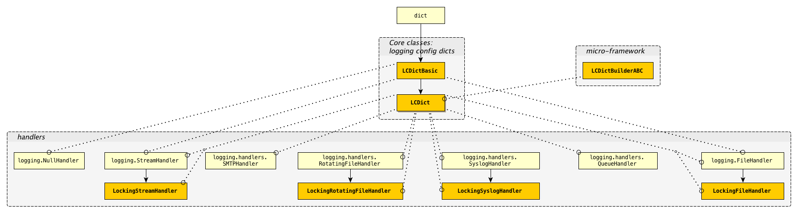

Class Reference
=========================

`prelogging` isn't a large package: it's a few, mostly small classes in four
modules.

.. toctree::
    :maxdepth: 1

    lcdictbasic
    lcdict
    locking_handlers
    LCDictBuilderABC

class diagram
----------------

.. include:: _global.rst

.. _prelogging-all-classes:

    |br| **prelogging** classes and their superclasses

    +-----------------------+-----------------------+
    | Symbol                | Meaning               |
    +=======================+=======================+
    | .. image:: arrsup.png | is a superclass of    |
    +-----------------------+-----------------------+
    | .. image:: arruse.png | uses (instantiates)   |
    +-----------------------+-----------------------+

