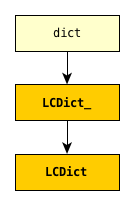

Configuring logging using `lcd`
----------------------------------

`lcd` provides a hybrid approach to configuration, offering the best of both the
static and dynamic worlds. It provides a streamlined API for setting up logging,
making it easy to use advanced features such as rotating log files and email
handlers. `lcd` also supplies missing functionality: the package provides
multiprocessing-safe logging to the console, to files and rotating files, and
to `syslog`.

The centerpiece of `lcd` is the ``LCDEx`` class.

    The central `lcd` classes

`lcd` defines two classes, a ``dict`` subclass ``LCD``, and `its` subclass
``LCDEx``, which represent logging configuration dictionaries — *logging config
dicts*, for short. ``LCD`` provides the basic model of building a logging config
dict; ``LCDEx`` supplies additional conveniences including predefined formatters
and easy access to advanced features such filter creation and as
multiprocessing-safe rotating file handlers.

You use the methods of these classes to add specifications of named
``Formatter``\s, ``Handler``\s, ``Logger``\s, and optional ``Filter``\s, and
containment relations between them. Once you've done so, calling the
``config()`` method of an ``LCD`` configures logging by passing itself, as a
``dict``, to ``logging.config.dictConfig()``. This call creates all the objects
and linkages specified by the underlying dictionary.

Show how `lcd` can achieve the same configuration more concisely, readably and
robustly.

    example using LCD

    example using LCDEx, even more concisely

`lcd` what it does why it's so cool -- redundant with stuff from next chapter
------------------------------------------------------------------------------

`lcd` occupies a middle ground: it provides a clean, consistent and concise
API for incrementally constructing logging config dicts.

The ``add_*`` methods
let you specify new logging entities entities (formatters, possibly filters,
handlers, loggers), which all have names.

Each call to one of the ``add_*`` methods adds an item
to one of the subdictionaries ``'formatters'``, ``'filters'``, ``'handlers'``
or ``'loggers'``. You can specify all of the item's dependencies in this call,
using names of previously added items, and/or you can add dependencies
subsequently with the ``attach_*`` methods.

error-checking and warnings ! :)

inconsistent camelCase <-- fixups

Using `lcd`, you build a logging config dict using a succession of
method calls that all take keyword parameters. The keyword parameters are
consistently snake_case versions of their corresponding keys in logging config
dicts; their default values are, with rare, documented exceptions, the same as
those of `logging`.
Each call to one of the ``add_*`` methods adds an item
to one of the subdictionaries ``'formatters'``, ``'filters'``, ``'handlers'``
or ``'loggers'``. You can specify all of the item's dependencies in this call,
using names of previously added items, and/or you can add dependencies
subsequently with the ``attach_*`` methods. For example, in the following code:

.. code::

    >>> from lcd import LCD
    >>> d = LCD()
    >>> d.add_formatter('simple', '{message}', style='{')

the ``add_formatter`` call adds an item to the ``'formatters'``
subdictionary of ``d``. If ``d`` were declared statically as a dict,
it would look like this::

    d = {
        ...
        'filters':     {},

        'formatters' : { 'simple': { 'class': 'logging.Formatter',
                                     'format': '{message}',
                                     'style': '{' },
                       },
        'handlers':    {},
        'loggers':     {},
        ...
    }

An LCD makes its top-level subdictionaries available as properties with the
same names as the keys: d.formatters == d['formatters'], d.handlers == d['handlers'],
and similarly for d.filters, d.loggers, d.root. After the above ``add_formatter``
call, ::

    >>> d.formatters                # ignoring whitespace,
    {'simple': {format: '{message}',
                'style': '{'}
    }

Order of definition
+++++++++++++++++++++++++++++++++

While configuring logging, you give a name to each of the objects that you
define. When defining a higher-level object, you identify its constituent
lower-level objects by name.

``Formatter``\s and ``Filter``\s (if any) don't depend on any other logging
objects, so they should be defined first. Next, define ``Handler``\s, and
finally, ``Logger``\s that use already-defined ``Handler``\s (and, perhaps,
``Filter``\s). `lcd` supplies dedicated methods for configuring the root logger
(setting its level, attaching handlers and filters to it), but often a
general-purpose `lcd` method can also be used, by referring to the root logger
by name: ``''``.

.. note::
    Once logging is configured, only the names of ``Logger``\s persist.
    `logging` retains *no associations* between the names you used to specify
    ``Formatter``, ``Handler`` and ``Filter`` objects, and the objects
    constructed to your specifications; you can't access those objects by any
    name.

Typically, we won't require any ``Filter``\s, and then, setting up logging
involves just these steps:

* define ``Formatter``\s
* define ``Handler``\s that use the ``Formatter``\s
* define ``Logger``\s that use the ``Handler``\s.

In common cases, such as the :ref:`Configuration requirements <example-overview-config>`,
`lcd` eliminates the first step and makes the last step trivial.

----------------------

Configuration with `lcd`
~~~~~~~~~~~~~~~~~~~~~~~~~~~~

`lcd` simplifies the creation of "logging config dicts" by breaking the process
down into easy, natural steps. As much as is possible, with `lcd` you only have
to specify the objects you care about and what's special about them; everything
else receives reasonable, expected defaults. Using the "batteries included"
``lcd.LCDEx`` class lets us concisely specify the desired setup:

.. code::

    from lcd import LCDEx

    lcd_ex = LCDEx(root_level='DEBUG',
                   attach_handlers_to_root=True)
    lcd_ex.add_stderr_handler(
                    'console',
                    formatter='msg',
                    level='INFO'
    ).add_file_handler('file_handler',
                       formatter='logger_level_msg',
                       filename='blather.log',
    )
    lcd_ex.config()

Here, we use a couple of the builtin ``Formatter``\s supplied by
``LCDEx``. Because we pass the flag
``attach_handlers_to_root=True`` when creating the instance ``lcd_ex``,
every handler we add to ``lcd_ex`` is automatically attached to the root logger.
Later, we'll
:ref:`revisit this example <overview-example-using-only-LCD>`,
to see how to achieve the same result using only ``LCD``.

Remarks
^^^^^^^^^^

To allow chaining, as in the above example, the methods of ``LCD``
and ``LCDEx`` generally return ``self``.

You can use the ``dump()`` method of a ``LCD`` to prettyprint its
underlying ``dict``. In fact, that's how we determined the value of
``config_dict`` for the following subsection.

