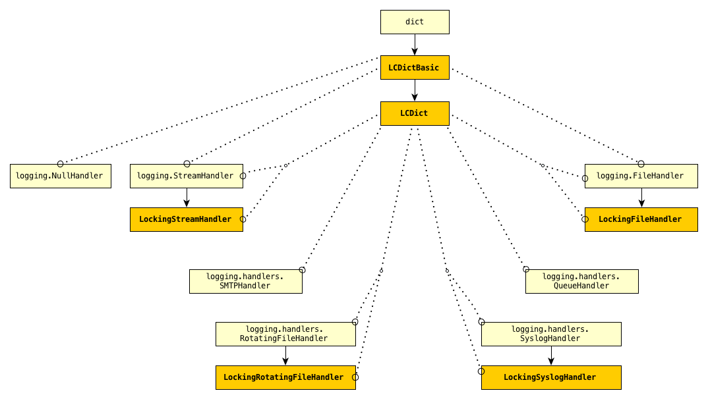

Introduction: `lcd` does... *what*?
==============================================

.. todo::

    Introduction to `lcd`: what  `lcd` is and does,
    blah blah

.. _lcd-all-classes-except-ABC:

    **lcd** classes and their superclasses (LCDictBuilderABC omitted)

    +-----------------------+-----------------------+
    | Symbol                | Meaning               |
    +=======================+=======================+
    | .. image:: arrsup.png | is a superclass of    |
    +-----------------------+-----------------------+
    | .. image:: arruse.png | uses                  |
    +-----------------------+-----------------------+

