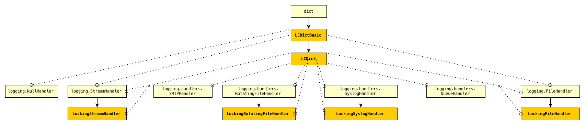

Introduction: `prelogging` does... *what*?
==============================================

.. todo::

    Introduction to `prelogging`: what `prelogging` is and does,
    blah blah

| :math:`\mathsf{pro-}` \|prəʊ\|
| prefix
|
| :math:`\mathsf{pro-}^{\mathbf{1}}`
| 1 favoring; supporting: *pro-choice*, *pro-democracy*.
| 3 denoting motion forward ... : *proceed*, *propel*, *prostrate*.
| ORIGIN from Latin *pro* ‘in front of', 'on behalf of', ... .
|
| :math:`\mathsf{pro-}^{\mathbf{2}}`
| before in time, place, order, etc.: *prologue*, *proactive*, *prognosis*.
| ORIGIN from Greek *pro* ‘before’, 'beforehand', 'in front of'.

.. _prologging-all-classes-except-ABC:

    **prelogging** classes and their superclasses (LCDictBuilderABC omitted)

    +-----------------------+-----------------------+
    | Symbol                | Meaning               |
    +=======================+=======================+
    | .. image:: arrsup.png | is a superclass of    |
    +-----------------------+-----------------------+
    | .. image:: arruse.png | uses (instantiates)   |
    +-----------------------+-----------------------+

