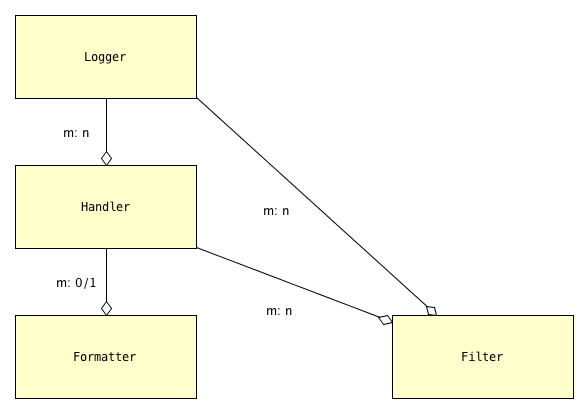

.. _overview:

Overview of Logging
=============================================

Logging is an important part of a program's internal operations, an essential
tool for development, debugging, troubleshooting, performance-tuning and
general maintenance. A program *logs messages* in order to record
its successive states, and to report any anomalies, unexpected situations or
errors, together with enough context to aid diagnosis. Messages can be logged
to multiple destinations at once — ``stderr`` in a terminal, a local file,
the system log, email, or a Unix log server over TCP, to cite common choices.

At the end of this chapter we provide several :ref:`logging_docs_links`,
for reference and general culture. It's not our purpose to rehash or
repeat the extensive (and generally quite good) documentation for Python's
`logging` package; in fact, we presuppose that you're familiar with basic
concepts and standard use cases. Nevertheless, it will be helpful to review
several topics, and in the process clarify some obscure features of `logging`.

Using `logging`
-------------------------------------

A program logs messages using the ``log`` method of objects called *loggers*,
which are implemented in `logging` by the ``Logger`` class. You can think of
the ``log`` method as a pumped-up ``print`` statement. It writes a message,
tagged with a level of severity, to zero or more destinations.
In `logging`, a *handler* — a ``Handler`` object — represents a single
destination, together with a specified output format.
A handler implements abstract methods which format message data into structured
text and write or transmit that text to the output.
A logger contains zero or more handlers.
When a program logs a message by calling a logger's ``log`` method (or a
shorthand method such as ``debug`` or ``warning``), the logger dispatches the
message data to its handlers.

All messages have a `logging level`, or `loglevel`, indicating their severity
or importance. The predefined levels in ``logging`` are ``DEBUG``, ``INFO``,
``WARNING``, ``ERROR``, ``CRITICAL``, listed in order of increasing severity.
Both loggers and handlers have an associated *loglevel*, indicating a
severity threshold: a logger or a handler will filter out any message whose
loglevel is less than its own. In order for a message to actually be sent
to a particular destination, its loglevel must equal or exceed the loglevels
of both the logger and the handler representing the destination.

**Note**: This last statement is *basically* true, but glosses over details.
We'll sharpen it below, in the subsection :ref:`How a message is logged <how_a_message_is_logged>`.

.. sidebar:: Sensible choices for dedicated loggers

    The logger named ``'__name__'`` is the standard choice for a module's
    dedicated logger; the logger named ``'__package__'`` is a great choice for
    a package. Without any configuration, these will just write message text to
    ``stderr``.

This elegant system allows developers to easily dial in different amounts
of logging verbosity. When developing a module or package, you can use a
dedicated logger to log internal messages at thoughtfully chosen loglevels.
In development, set the logger's loglevel to ``DEBUG`` or ``INFO`` as needed;
once the module/package is in good condition, raise that to ``WARNING``; in
production, use ``ERROR``. There's no need to delete or comment out the lines
of code that log messages, or to precede each such block with a conditional guard.
The logging facility is a very sophisticated version of using the ``print``
statement for debugging.

`logging` classes that can be configured
-----------------------------------------------

`logging` defines a few types of entities, culminating in the ``Logger``
class. Typically, a program or library will set up, or *configure*, logging
only once, at startup. This entails specifying message formats, destinations,
loggers, and containment relations between those things. Once a program has
configured logging as desired, use of loggers is very straightforward.
Configuration, then, is the only barrier to entry.

The following diagram displays the types that can be configured statically,
and their dependencies:

.. index:: diagram: The objects of `logging` configuration

.. _logging-config-classes:

    The objects of `logging` configuration

    +-----------------------+-----------------------+
    | Symbol                | Meaning               |
    +=======================+=======================+
    | .. image:: arrowO.png | has zero or more      |
    +-----------------------+-----------------------+
    | m: 0/1                | many-to-(zero-or-one) |
    +-----------------------+-----------------------+
    | m: n                  | many-to-many          |
    +-----------------------+-----------------------+

In words:

    * a ``Logger`` can have one or more ``Handler``\s, and a ``Handler``
      can be used by multiple ``Logger``\s;
    * a ``Handler`` has at most one ``Formatter``, but a ``Formatter``
      can be shared by multiple ``Handler``\s;
    * ``Handler``\s and ``Logger``\s can each have zero or more ``Filter``\s;
      a ``Filter`` can be used by multiple ``Handler``\s and/or ``Logger``\s.

What these objects do
++++++++++++++++++++++++++++++++++++++++++++++++++++++++++++++++++

A ``Formatter`` is basically just a format string that uses keywords
defined by the `logging` module — for example, ``'%(message)s'`` and
``'%(name)-20s: %(levelname)-8s: %(message)s'``.

A ``Handler`` formats and writes logged messages to a particular
destination — a stream (e.g. ``sys.stderr``, ``sys.stdout``, or an in-memory
stream such as an ``io.StringIO``), a file, a rotating set of files, a socket,
etc.

A ``Logger`` sends logged messages to its associated handlers. Various
criteria filter out which messages are actually written, notably loglevel
thresholding as described above and in greater detail :ref:`below <how_a_message_is_logged>`.

``Filter``\s provide still more fine-grained control over which messages are
written. They can also be used to modify messages or supplement them with
additional context.

.. index:: logger names

Loggers are identified by name
-------------------------------------------

A logger is uniquely identified by name (except for the name ``'root'``: see the
Warning below). For example, the expression ``logging.getLogger('mylogger')``
always denotes the same object, no matter where in a program it occurs or when
it's evaluated. The `logging` package always creates a special logger, the *root
logger*, which *we*, as users of `logging`, identify by the name ``''`` (the
empty string); it's accessed by the expression ``logging.getLogger('')``, or
equivalently by ``logging.getLogger()``.

.. index:: root logger names (warning re pitfalls)

.. warning::

    The root logger's name is set to, and reported as, ``'root'``:
        >>> logging.getLogger('').name
        'root'
    Confusingly, however, you cannot access the root logger by that name:
        >>> logging.getLogger('') is logging.getLogger('root')
        False
    It's most unfortunate that these two *distinct* loggers share the same name:
        >>> logging.getLogger('root').name
        'root'

    **Do not use the logger name** ``'root'``.

Logger names are *dotted names*, and behave in a way that's analogous to package
and module names. The analogy is intentional, to facilitate a style of logging
in which each package, and/or each module, uses its own logger, with names
``__package__`` and ``__name__`` respectively. The basic idioms are, for example::

    logging.getLogger(__name__).debug("About to do that thing")

and::

    logging.getLogger(__package__).warning("dict of defaults is empty")

Broadly speaking, a logger corresponds to an "area" of your program; you're free
to construe that in whatever way suits your needs and situation.

.. _ANCESTORS:

.. index:: logger parent, logger children
.. index:: logger ancestors, ancestors of a logger

The parent-child and ancestor relationships between loggers
+++++++++++++++++++++++++++++++++++++++++++++++++++++++++++++++++++

A parent-child relation obtains among loggers: the parent of a logger ``'a.b.c'``
is the logger ``'a.b'``, whose parent is ``'a'``; the parent of logger ``'a'``
is the root logger, identified by ``''``. The logger ``'a'`` is an *ancestor* of
both ``'a.b'`` and ``'a.b.c'``; ``'a.b'`` is an ancestor of ``'a.b.c'``;
the root logger is an ancestor of every other logger. (Note, though, that ``aa``
is *not* a parent or ancestor of ``a``, nor is ``a.b`` a parent or ancestor
of ``a.bxyz``: the relation isn't just "startswith" between strings.)

.. _how_a_message_is_logged:

.. index:: How a message is logged

How a message is logged
---------------------------------

In order to explain what happens when a logger logs a message,

.. code::

    logger.log(level, message)

we first have to introduce a few more concepts:

    * the 'NOTSET' loglevel
    * the "effective level" of a logger
    * the ``propagate`` flag of a logger.

.. _NOTSET:

.. index:: NOTSET (special loglevel)

The special loglevel **NOTSET**
+++++++++++++++++++++++++++++++++++++++++++++++++

There's actually a sixth predefined loglevel, ``NOTSET``, whose numeric
value is 0, lower than the "real" loglevels (``DEBUG`` = 10, ..., ``CRITICAL`` = 50),
which are all non-zero. The root logger by default has loglevel ``WARNING``, but
all created loggers and handlers have default loglevel ``NOTSET``.

``NOTSET`` is useless as a loglevel of individual messages. You can't successfully
log a message at level ``NOTSET`` — nothing happens (unless you do something unusual.
If you call ``logging.disable(neg)`` with some negative integer ``neg``, you can get
``logger.log(0, message)`` to emit ``message``; but ordinarily, you wouldn't, and
it won't.)

A handler with loglevel ``NOTSET`` rejects no messages; it's the most inclusive
level.

When a logger has loglevel ``NOTSET``, the loglevels of its ancestors
are examined to compute its *effective level* — the level that `logging` uses
to determine whether a message that the logger logs will be sent to handlers or not.

.. _effective_level:

.. index:: effective level of a logger

The "effective level" of a logger
+++++++++++++++++++++++++++++++++++++++++++++++++

The *effective level* of a logger is its own level if that is non-zero;
otherwise, it's the level of its nearest ancestor whose level is non-zero;
otherwise, if there's no such ancestor, it's ``NOTSET`` (0). The ``Logger`` method
``getEffectiveLevel()`` returns this value. Its docstring explains that it "[loops]
through [the] logger and its parents in the logger hierarchy, looking for a non-zero
logging level[, returning] the first one found." (``getEffectiveLevel()`` is in the
``__init__.py`` module of `logging`.)

Now we can make good on an earlier promise – the following statement isn't just
"basically true" but really is the case:

    | In order for a message to actually be written to a particular destination,
    | its level must equal or exceed the *effective level* of the logger that
    | logged it, as well as the level of the handler representing the destination.

In the next subsection we'll explain just which handlers a message is sent to
when its level clears the effective level threshold.

.. _propagation:

.. index:: propagate flag of a logger

Propagation
+++++++++++++++++++++++++++++++++++++++++++++++++

Loggers have a ``propagate`` attribute, a flag, which by default is True.

``propagate`` determines which handlers a ``message`` is sent to when a ``logger``
logs it at a particular ``level`` via a call such as ``logger.log(level, message)``.

If ``logger`` has handlers, the ``message`` is sent to them. If ``logger`` isn't
the root and ``logger.propagate`` is True, the message is *also* sent to any
handlers of the logger's parent; if the parent isn't the root and its ``propagate``
flag is True, the message is sent to the handlers of the parent's parent; and so
on, until this process reaches either the root or an ancestor whose ``propagate``
flag is False.

If no handlers are encountered in this procedure, in Python 3.2+ the message is sent
to the "handler of last resort", ``logging.LastResort``, whose loglevel is 'WARNING',
and which simply writes the message to ``stderr``.  (In earlier versions of Python,
or if you set ``logging.LastResort = None`` in 3.2+, an error message is written
to ``stderr`` that no handlers could be found for the logger.)

.. note::
    The `logging` documentation contains a `pair of flowcharts <https://docs.python.org/3/howto/logging.html#logging-flow>`_,
    "Logging flow" and "Handler flow", which summarize what this section,
    :ref:`How a message is logged<how_a_message_is_logged>`, has described; however,
    they predate Python 3.2, so "Handler flow" doesn't mention the "last resort" handler.

`logging` defaults
---------------------
`logging` supplies reasonable out-of-the-box defaults and shorthands so that you
can easily start to use its capabilities.

When accessed for the first time, the ``Logger`` named ``'mylogger'`` is created
"just in time" if it hasn't been explicitly configured. You don't *have* to
attach handlers to ``'mylogger'``; logging a message with that logger will "just
work". Suppose this is a complete program::

    import logging
    ``logging.getLogger('mylogger').warning("Hi there")``

When run, it writes ``Hi there`` to ``stderr``. In light of the last section,
we can now understand why. The effective level of ``'mylogger'`` is the level of
its parent, the root logger, which is ``WARNING``, and the level of the message clears
that. Thus, the message is sent to ``'mylogger'``'s handlers (none). Because
``'mylogger'`` has ``propagate`` set to True, the message is also sent to
the handlers of the root. The root has no handlers, so the message is sent to the
last resort handler, whose loglevel is ``WARNING``, which lets the message through,
writing it to ``stderr``.

The ``warning(...)`` logger method shown above is a shorthand for
``log(logging.WARNING, ...)``. Similarly, there are convenience methods ``debug``,
``info``, ``error`` and ``critical``.

--------------------------------------------------------

For another example, you can just say:

    ``logging.error("Something went wrong")``

and something plausible will happen (again, the string will be written to
``stderr``). This works because ``logging.error(...)`` is a shorthand for
``logging.log(logging.ERROR, ...)``, which in turn is a shorthand for
``logging.getLogger().log(logging.ERROR, ...)``.

--------------------------------------------------------

.. sidebar:: logging.basicConfig()

    The `logging.basicConfig() <https://docs.python.org/3/library/logging.html#logging.basicConfig>`_
    function lets you configure the root logger (up to a point), using
    a monolithic function that's somewhat complex yet of limited capabilities.

In many cases, to configure logging it's sufficient just to add a handler or
two and attach them to the root.

In the next chapter, we'll examine the approaches to configuration offered by
`logging`, and then see how `prelogging` simplifies the process.

.. _logging_docs_links:

`logging` documentation links
----------------------------------------------------

See the `logging docs <https://docs.python.org/3/library/logging.html?highlight=logging>`_
for the official explanation of how Python logging works.

For the definitive account of static configuration, see the documentation of
`logging.config <https://docs.python.org/3/library/logging.config.html?highlight=logging>`_,
in particular the documentation for
`the format of a logging configuration dictionary <https://docs.python.org/3/library/logging.config.html#logging-config-dictschema>`_.

Here's a useful reference:
`the complete list of keywords that can appear in formatters <https://docs.python.org/3/library/logging.html#logrecord-attributes>`_.

The logging `HOWTO <https://docs.python.org/3/howto/logging.html>`_
contains tutorials that show typical setups and uses of logging, configured in
code at runtime.
The `logging Cookbook <https://docs.python.org/3/howto/logging-cookbook.html#logging-cookbook>`_
contains a wealth of techniques, several of which exceed the scope of `prelogging` because
they involve `logging` capabilities that can't be configured statically (e.g. the use of
`LoggerAdapters <https://docs.python.org/3/library/logging.html#loggeradapter-objects>`_,
or
`QueueListeners <https://docs.python.org/3/library/logging.handlers.html#queuelistener>`_
). A few of the examples contained in the `prelogging` distribution are examples from
the Cookbook and HOWTO, reworked to use `prelogging`.

The `logging` package supports multithreaded operation, but does **not** directly support
`logging to a single file from multiple processes <https://docs.python.org/3/howto/logging-cookbook.html#logging-to-a-single-file-from-multiple-processes>`_.
Happily, `prelogging` does, in a couple of ways, both illustrated by examples.

One additional resource merits mention: the documentation for
`logging in Django <https://docs.djangoproject.com/en/1.9/topics/logging/>`_
provides another, excellent overview of logging and configuration, with
examples. Its first few sections aren't at all Django-specific.
