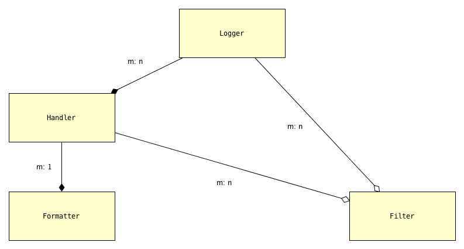

.. _overview:

Overview of logging and configuration
=============================================

Logging is an important part of a program's internal operations, an essential
tool for development, debugging, troubleshooting, performance-tuning and
general maintenance. A program *logs messages* in order to record
its successive states, and to report any anomalies, unexpected situations or
errors, together with enough context to aid diagnosis. Messages can be logged
to multiple destinations at once — ``stderr`` in a terminal, a local file,
the system log, email, or a Unix log server over TCP, to cite popular choices.

It's not our purpose to rehash or repeat the extensive (and generally quite
good) documentation of Python's `logging` package; in fact, we presuppose that
you're familiar with basic concepts and standard use cases. At the end of this
chapter we provide several :ref:`logging_docs_links`, which you can explore
before or in tandem with the `lcd` documentation. Nevertheless, it will be
helpful to review several topics.

The uses of logging
-------------------------------------

A program logs messages using the ``log`` method of objects called *loggers*,
which are implemented in `logging` by the ``Logger`` class. You can think of
the ``log`` method as a pumped-up ``print`` statement. It writes a message,
tagged with a level of severity, to one or more destinations.
In `logging`, a ``Handler`` object — a *handler* — represents a single
destination, together with a specified output format.
A handler implements abstract methods which format message data into structured
text and write or transmit that text to the output.
A logger contains zero or more handlers.
When a program calls a logger's ``log`` method to log a message, the logger
dispatches the message data to its handlers.

All messages have a `logging level`, or `loglevel`, indicating their severity
or importance — ``DEBUG``, ``INFO``, ``WARNING``, ``ERROR``, ``CRITICAL`` are
the basic categories, listed in order of increasing severity. Both loggers
and handlers have an associated *loglevel*, indicating a severity threshold:
a logger or a handler will filter out any message whose loglevel is less than
its own. In order for a message to actually be written to a particular
destination, its loglevel must equal or exceed the loglevels of both the
logger and the handler representing the destination.

This allows developers to dial in different amounts of logging verbosity:
you might set a logger's level to ``DEBUG`` in development but to
``ERROR`` in production. There's no need to delete or comment out
the lines of code that log messages, or to precede each such block with a
conditional guard. The logging facility is a very sophisticated version of using
the `print` statement for debugging.

`logging`-configuration classes
----------------------------------

`logging` defines a few types of entities, which support the ``Logger``
class. In general, a program or library will set up, or *configure*, logging
only once, at startup. This entails specifying message formats, destinations,
loggers, and containment relations between those things. Once a program has
configured logging as desired, use of loggers is very straightforward.
Configuration, then, is the only barrier to entry.

The following diagram displays the types involved in logging configuration,
and their dependencies:

    The objects of `logging` configuration

    +-----------------------+-----------------------+
    | Symbol                | Meaning               |
    +=======================+=======================+
    | .. image:: arrow.png  | has one or more       |
    +-----------------------+-----------------------+
    | .. image:: arrowO.png | has zero or more      |
    +-----------------------+-----------------------+
    | m: 1                  | many-to-one           |
    +-----------------------+-----------------------+
    | m: n                  | many-to-many          |
    +-----------------------+-----------------------+

In words:

    * a ``Logger`` can have one or more ``Handler``\s, and a ``Handler``
      can be used by multiple ``Logger``\s;
    * a ``Handler`` has just one ``Formatter``, but a ``Formatter``
      can be shared by multiple ``Handler``\s;
    * ``Handler``\s and ``Logger``\s can each have zero or more ``Filter``\s;
      a ``Filter`` can be used by multiple ``Handler``\s and/or ``Logger``\s.

What these objects do
++++++++++++++++++++++++++++++++++++++++++++++++++++++++++++++++++

A ``Formatter`` is basically just a format string that uses keywords
defined by the `logging` module — for example, ``'%(message)s'`` and
``'%(name)-20s: %(levelname)-8s: %(message)s'``.

A ``Handler`` formats and writes formatted logged messages to a particular
destination — a stream (e.g. ``sys.stderr``, ``sys.stdout``, or an in-memory
stream such as an ``io.StringIO()``), a file, a rotating set of files, a socket,
etc.

A ``Logger`` sends logged messages to its associated handlers. Various
criteria filter out which messages are actually written, notably loglevel
thresholding as described above.

``Filter``\s provide still more fine-grained control over which messages are
written.

Loggers are identified by name
-------------------------------------------

A logger is uniquely identified by name: the expression
``logging.getLogger('mylogger')``, for example, always denotes the same object,
no matter where in a program it occurs or when it's evaluated.
The `logging` package always creates a special logger, the *root logger*, whose
name is ``''``; it's accessed by the expression ``logging.getLogger('')``,
or equivalently by ``logging.getLogger()``.

Logger names are *dotted names*, and behave in a way that's intentionally
analogous to package names. A parent-child relation obtains among loggers:
the parent of a logger ``a.b.c`` is the logger ``a.b``, whose parent is ``a``;
the parent of logger ``a`` is the root logger.

`logging` defaults
---------------------
`logging` supplies reasonable out-of-the-box defaults and shorthands so that you
can easily start to use its capabilities.

When accessed for the first time, the ``Logger`` named ``'mylogger'`` is created
"just in time" if it hasn't been explicitly configured. You don't *have* to
attach handlers to ``'mylogger'``; logging a message with that logger will "just
work". If ``'mylogger'`` has no handlers and you say:

    ``logging.getLogger('mylogger').warning("Hi there")``

then ``Hi there`` will be written to ``stderr``. Here's why: by default, a
logger "propagates" messages to its parent, so if ``'mylogger'`` lacks
handlers, the message will be logged by its parent, using the parent's handlers.
The parent of ``'mylogger'`` is the root, which by default (in the absence of
configured handlers) writes messages to ``stderr``.

The ``debug(...)`` logger method shown above is a shorthand for
``log(logging.DEBUG, ...)``. Similarly, there are convenience methods ``debug``,
``info``, ``error`` and ``critical``.

For another example, you can just say:

    ``logging.error("Something went wrong")``

and something plausible will happen (again, the string will be written to
``stderr``). This works because ``logging.error(...)`` is a shorthand for
``logging.log(logging.ERROR, ...)``, which in turn is a shorthand for
``logging.getLogger().log(logging.ERROR, ...)``.

In many cases, to configure logging it's sufficient just to add a handler or
two and attach them to the root.

    The `logging.basicConfig() <https://docs.python.org/3/library/logging.html#logging.basicConfig>`_
    function lets you configure the root logger, anyway to a point, using
    a monolithic function that's somewhat complex yet of limited capabilities.

Logging configuration requirements — use case
------------------------------------------------------------

We'll use a simple example to discuss and compare various approaches to logging
configuration — using the facilities provided by the `logging` package, and then
using `lcd`.

Suppose we want the following configuration:

.. _example-overview-config:

    **Configuration requirements**

    Messages should be logged to both ``stderr`` and a file. Only messages with
    loglevel ``INFO`` or higher should appear on-screen, but all messages should
    be logged to the file. Messages to ``stderr`` should consist of just the
    message, but messages written to the file should contain the logger name and
    the message's loglevel.

    The logfile contents should persist: the file handler should **append**
    to the logfile, rather than overwriting it each time the program using these
    loggers is run.

This suggests two handlers, each with an appropriate formatter — a ``stderr``
console handler with level ``INFO``, and a file handler with level ``DEBUG``
or, better, ``NOTSET``. (``NOTSET`` is the default loglevel for handlers.
Numerically less than ``DEBUG``, all loglevels are greater than or equal to it.)
Both handlers should be attached to the root logger, which should have level
``DEBUG`` to allow all messages through. The file handler should be created with
``mode='a'`` (append, not ``'w'`` for overwrite) so that the the logfile
contents can persist.

The example configuration in use
+++++++++++++++++++++++++++++++++++

Once this configuration is established, these logging calls:

.. code::

    import logging
    root_logger = logging.getLogger()
    root_logger.debug("1. 0 = 0")
    root_logger.info("2. days are getting shorter")
    root_logger.debug("3. 0 != 1")
    # ...
    logging.getLogger('submodule_A').info("4. submodule_A initialized")

should produce the following ``stderr`` output:

.. code::

    2. days are getting shorter
    4. submodule_A initialized

and the logfile should contain (something much like) these lines:

.. code::

    root                : DEBUG   : 1. 0 = 0
    root                : INFO    : 2. days are getting shorter
    root                : DEBUG   : 3. 0 != 1
    submodule_A         : INFO    : 4. submodule_A initialized

Configuring logging using what `logging` provides
---------------------------------------------------

The `logging` package offers two approaches to configuration:

* dynamic, in code;
* static (and then, there are two ways to go about this).

These approaches might also be called *imperative* and *declarative*, respectively.
The following subsections show how these approaches configure logging to meet
the requirements stated above.

Dynamic configuration (in code)
+++++++++++++++++++++++++++++++++++

Here's how to dynamically configure logging according to satisfy the given
requirements::

    import logging
    import sys

    root = logging.getLogger()
    root.setLevel(logging.DEBUG)

    # Create stderr handler,
    #   level = INFO, formatter = default i.e. '%(message)s';
    # attach it to root
    h_stderr = logging.StreamHandler(stream=sys.stderr)
    h_stderr.setLevel(logging.INFO)
    root.addHandler(h_stderr)

    # Create file handler, level = NOTSET (default),
    #   filename='blather_dyn_cfg.log', formatter = logger/level/msg
    # attach it to root
    logger_level_msg_fmtr = logging.Formatter('%(name)-20s: %(levelname)-8s: %(message)s')
    h_file = logging.FileHandler(filename='blather_dyn_cfg.log')
    h_file.setFormatter(logger_level_msg_fmtr)
    root.addHandler(h_file)

We've used a number of defaults. It was unnecessary to add::

    msg_fmtr = logging.Formatter('%(message)s')
    h_stderr.setFormatter(msg_fmtr)

because the same effect is achieved without them. The default ``mode`` of a
``FileHandler`` is ``a``, which opens the logfile for appending, as per our
requirements; thus it wasn't necessary to provide ``mode='a'`` to the
``FileHandler`` constructor. (We omitted other arguments to this constructor,
e.g. ``delay``, whose default values are suitable.) Similarly, it wasn't
necessary to set the level of the file handler, as the default level ``NOTSET``
is just what we want.

Advantages of dynamic configuration
~~~~~~~~~~~~~~~~~~~~~~~~~~~~~~~~~~~~~

* Hierarchy of logging entities respected

  Formatters must be created before the handlers that use them;
  handlers must be created before the loggers to which they're attached.

  You can configure the entities of logging (formatters, optional filters,
  handlers, loggers) one by one, in order, starting with those that don't
  depend on other entities, and proceeding to those that use entities
  already defined.

* You can take advantage of the reasonable defaults provided by the methods
  of the `logging` API. When configuring logging statically, various fussy
  defaults must be specified explicitly.

* Error prevention

  For instance, there's no way to attach things that simply don't exist.

* Fine-grained error detection

  If you use a nonexistent keyword argument, for example, the line in which it
  occurs gives an error; you don't have to wait until all configuration is
  complete to learn that something was amiss.

  Thus it's easier to debug: each step taken is rather small, and you can fail
  faster than when configuring from an entire dictionary.

Disadvantages of dynamic configuration
~~~~~~~~~~~~~~~~~~~~~~~~~~~~~~~~~~~~~~~~

    * Low-level methods, inconsistent API

      The ``Handler`` base class takes a keyword argument ``level``,
      its subclass ``StreamHandler`` takes a keyword argument ``stream``,
      but doesn't recognize ``level``. Thus we couldn't concisely say::

          h_stderr = logging.StreamHandler(level=logging.INFO, stream=sys.stderr)

      but had to call ``h_stderr.setLevel`` after constructing the handler.

    * In `logging`, only loggers have names; formatters, handlers and filters
      don't. Thus we have to use Python variables to reference the various
      logging entities which we create and connect. If another part of the
      program later wanted to access, say, the file handler attached to the
      root logger, the only way it could do so would be by iterating through
      the ``handlers`` collection of the root and examining the type of each::

          root = logging.getLogger()
          fh = [h for h in root.handlers if isinstance(h, logging.FileHandler)][0]

    * Somehow it winds up more even verbose than static dictionaries —
      the methods are low-level, and many boilerplate passages recur
      in dynamic configuration code.

Static configuration
+++++++++++++++++++++++++++++++++++

.. todo:: <<<<<< RESUME >>>>>>

The `logging.config` submodule offers two equivalent ways to specify
configuration statically:

* with a dictionary meeting various requirements (mandatory and optional keys,
  and their possible values), which is passed to ``logging.config.dictConfig()``;
* with a text file written in YAML, meeting analogous requirements,
  and passed to ``logging.config.fileConfig()``.

We'll call a dictionary that can be passed to ``dictConfig`` a *logging config
dict*. The `schema for configuration dictionaries <https://docs.python.org/3/library/logging.config.html#configuration-dictionary-schema>`_
documents the format of such dictionaries. (Amusingly, it uses YAML to do so!,
to cut down on the clutter of quotation marks and curly braces.)

We will deal only with logging config dicts, ignoring the YAML-based approach.
The Web frameworks Django and Flask configure logging with dictionaries.
(Django can accomodate YAML-based configuration, but its path of least resistance
is certainly the dict-based approach.) Dictionaries are native Python; YAML is not.
YAML may be more readable than dictionary specifications, but `lcd` offers
another, pure-Python solution to that problem.

Configuring logging for our requirements with a logging config dict
~~~~~~~~~~~~~~~~~~~~~~~~~~~~~~~~~~~~~~~~~~~~~~~~~~~~~~~~~~~~~~~~~~~~

Here's how to do so::

    import logging
    from logging import config

    config_dict = \
        {
         'formatters': {'logger_level_msg': {'class': 'logging.Formatter',
                                             'format': '%(name)-20s: %(levelname)-8s: '
                                                       '%(message)s'}},
         'handlers': {'h_stderr': {'class': 'logging.StreamHandler',
                                   'level': 'INFO',
                                   'stream': 'ext://sys.stderr'},
                      'h_file': {'class': 'logging.FileHandler',
                                 'filename': 'blather_stat_cfg.log',
                                 'formatter': 'logger_level_msg'}},
         'root': {'handlers': ['h_stderr', 'h_file'], 'level': 'DEBUG'},
         'version': 1}

    logging.config.dictConfig(config_dict)

As with dynamic configuration, most keys have default values, and we've
in the interest of brevity we've omitted those that already suit our needs. We
didn't specify a formatter for the stderr handler, nor the file
handler's mode or loglevel, and so on.

Advantages of static configuration
~~~~~~~~~~~~~~~~~~~~~~~~~~~~~~~~~~~~~~~~

* logging entities are referenced by name

  You give a name to every logging entity you specify, and then refer
  to it by that name when attaching it to higher-level entities.
  (It's true that after the call to ``dictConfig``, only the names of loggers
  endure; but that's a separate issue — a deficiency of `logging`, not of static
  configuration.)

* it's arguably more natural to specify configuration in a declarative way,
  especially for the typical application which will "set it and forget it"

Disadvantages of static configuration
~~~~~~~~~~~~~~~~~~~~~~~~~~~~~~~~~~~~~~~~

* not very good error detection (none until the ``dictConfig`` call)

* some boilerplate key/value pairs

* lots of noise — a sprawling thicket of nested curly braces, quotes, colons, etc.

  Medium-sized nested dicts are hard to read

* logging config dicts seem complex

  At least on first exposure to static configuration, it's not easy to
  comprehend a medium- to large-sized dict of dicts of dicts, in which many
  values are lists of keys occurring elsewhere in the structure.

Assessment [ "Summary" ? "Conclusions" ??]
-------------------------------------------

As we've seen, both approaches to configuration offered by the `logging`
package have virtues, but both have shortcomings:

* Its API, mostly dedicated to dynamic configuration, is at once complex and
  limited.
* With static configuration, no warnings are issued and no error checking occurs
  until ``dictConfig`` (or ``fileConfig``) is called.
* Of the various kinds of entities that `logging` constructs, only loggers have
  names, which can lead to various conundrums and contortions.

To these, we might add the general observation that the entire library is
written in thoroughgoing camelCase (except for inconsistencies — for example,
``levelname`` in format strings).

In the next chapter, we'll

<lead-in to next chapter -- `lcd` provides a middle ground / hybrid / best of both worlds;
 blah blah>

--------------------------------------------------------

.. _logging_docs_links:

`logging` documentation links
----------------------------------------------------

See the `logging docs <https://docs.python.org/3/library/logging.html?highlight=logging>`_
for the official explanation of how Python logging works.

For the definitive account of static configuration, see the documentation of
`logging.config <https://docs.python.org/3/library/logging.config.html?highlight=logging>`_,
in particular the documentation for
`the format of a logging configuration dictionary <https://docs.python.org/3/library/logging.config.html#logging-config-dictschema>`_.

The logging `HOWTO <https://docs.python.org/3/howto/logging.html>`_
contains tutorials that show typical setups and uses of logging, configured in
code at runtime.
The `logging Cookbook <https://docs.python.org/3/howto/logging-cookbook.html#logging-cookbook>`_
contains a wealth of techniques, several of which exceed the scope of `lcd` because
they involve `logging` capabilities that can't be configured statically (e.g.
the use of
`LoggerAdapters <https://docs.python.org/3/library/logging.html#loggeradapter-objects>`_,
or
`QueueListeners <https://docs.python.org/3/library/logging.handlers.html?#queuelistener>`_
). A few of the examples contained in the `lcd` distribution are examples from
the Cookbook and HOWTO, reworked to use `lcd`.

The `logging` package supports multithreaded operation, but does **not** directly support
`logging to a single file from multiple processes <https://docs.python.org/3/howto/logging-cookbook.html#logging-to-a-single-file-from-multiple-processes>`_.
Happily, `lcd` does, in a couple of ways.

One additional resource merits mention: the documentation for
`logging in Django <https://docs.djangoproject.com/en/1.9/topics/logging/>`_
provides another, excellent overview of logging and configuration, with
examples. Its first few sections aren't at all Django-specific.
