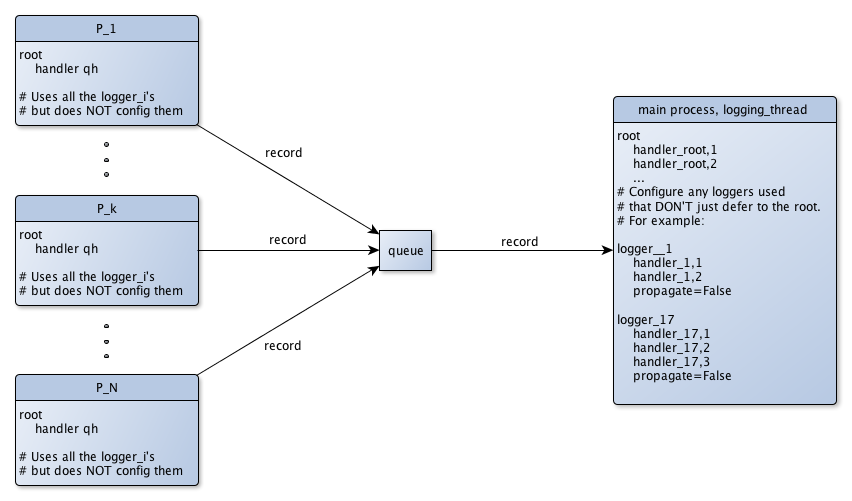

.. _further-topics-recipes:

Further Topics and Recipes
========================================

.. include:: _global.rst

* Configuration distributed across multiple modules or packages
    * :ref:`config-abc`
    * :ref:`migration-dynamic`
    * :ref:`migration-static`

* :ref:`Multiprocessing — two approaches<tr-mp>`
    .. hlist::
        :columns: 3

        * :ref:`mp-locking-handlers`
        * :ref:`mp-queue-and-logging-thread`

* Using `prelogging` in libraries
    * :ref:`Using add_null_handler <null-handler>`

* :ref:`using-prelogging-with-django`
    .. hlist::
        :columns: 3

        * :ref:`setting-LOGGING-Django-variable`


* :ref:`providing-extra-data-to-a-filter`
    .. hlist::
        :columns: 3

        * :ref:`providing-extra-static-data-to-a-filter`
        * :ref:`providing-extra-dynamic-data-to-a-filter`

* :ref:`adding-custom-fields-and-data-to-messages-with-formatter-and-filter`

* :ref:`smtp-handler`

----------------------------------

.. index:: LCDictBuilderABC

.. _config-abc:

Using ``LCDictBuilderABC``
-------------------------------

One way for a larger program to configure logging is to pass around an
``LCDict`` to the different "areas" of the program, each area contributing
specifications of the logging entities it will use.
The ``LCDictBuilderABC`` class provides a mini-microframework that automates
this approach: each area of a program need only define an ``LCDictBuilderABC``
subclass and override its method ``add_to_lcdict(lcd)``, where it contributes
its specifications by calling methods on ``lcd``.

The :ref:`LCDictBuilderABC` documentation describes how that class and its two
methods operate. The test ``tests/test_lcdict_builder.py`` illustrates using the
class to configure logging across multiple modules.

.. _migration-dynamic:

Migrating a project that uses dynamic configuration to `prelogging`
++++++++++++++++++++++++++++++++++++++++++++++++++++++++++++++++++++++++++++++

First a caveat: If your program uses the `logging` API throughout the course of
its execution to create or (re)configure logging entities, then
migration to `prelogging` may offer little gain: many of the runtime calls to
`logging` methods probably can't be replaced. In particular, obviously `prelogging`
provides no means to delete or detach logging entities.

However, if your program uses the `logging` API to configure logging
only at startup, in a "set it and forget it" way, then it's probably easy
to migrate it to `prelogging`. Benefits of doing so include clearer, more
concise code, and access to the various amenities of `prelogging`.

.. _migration-static:

Migrating a project that uses static dict-based configuration to `prelogging`
++++++++++++++++++++++++++++++++++++++++++++++++++++++++++++++++++++++++++++++

A common pattern for a large program that uses static dict-based configuration
is to pass around a single (logging config) dict to each "area" of the program;
each "area" adds its own required entities and possibly modifies those already
added; finally a top-level routine passes the dict to ``logging.config.dictConfig``.

Let's suppose that each program "area" modifies the logging config dict in
a function called ``add_to_config_dict(d: dict)``. These ``add_to_config_dict``
functions performs dict operations on the parameter ``d`` such as

    ``d['handlers']['another_formatter'] = { ... }``

and

    ``d.update( ... )``.

*Assuming your* ``add_to_config_dict`` *functions use "duck typing" and work
on any parameter* ``d`` *such that* ``isinstance(d, dict)`` *is true, they
should continue to work properly if you pass them an* LCDict.

Thus, the ``add_to_config_dict`` function specific to each
program area can easily be converted to an ``add_to_lcdict(cls, lcd: LCDict)``
classmethod of an :ref:`LCDictBuilderABC` subclass specific to that program area.


--------------------------------------------------

.. _tr-mp:

.. index:: Multiprocessing-aware logging — two approaches

Multiprocessing — two approaches
----------------------------------------------

The section of the `logging` Cookbook entitled
`Logging to a single file from multiple processes <https://docs.python.org/3/howto/logging-cookbook.html#logging-to-a-single-file-from-multiple-processes>`_
begins by admitting that "logging to a single file from multiple processes is
not supported". It goes on to discuss three approaches to providing this
capability:

    1. using ``SocketHandler``
    2. developing locking versions of handlers, the approach taken by
       `prelogging` with its "locking handlers"
    3. (*Python 3 only*) using a ``QueueHandler`` in each process, all writing
       to a common Queue, and then using either a ``QueueListener``
       or a dedicated thread in another process (e.g. the main one)
       to extract ``LogRecord``\s from the queue and log them.

**Note**: the third approach is unavailable in Python 2 because the class
``QueueHandler`` is Python 3 only.

The ``examples/`` top-level directory of the `prelogging` distribution contains
several multiprocessing examples. See the :ref:`mproc_examples` section of the
:ref:`guide-to-examples` for a list of them with descriptions of what
each one does.

In this section we'll discuss the second and third approaches.

.. _basic-mproc-situation:

.. topic:: Basic situation and challenge

    Suppose we have some significant amount of computational work to do, and
    the code that performs it uses logging. Let's say there are :math:`L` many
    loggers used:

    .. math::

        logger_1, \cdots, logger_i, \cdots, logger_L,

    Each logger :math:`logger_i` is denoted by some name :math:`name_i`,
    and has some intended handlers:

    .. math::

        handler_{i, j} \quad (j < n_i).

    Later, we notice that the work can be parallelized: we can partition it into
    chunks which can be worked on simultaneously and the results recombined.
    We put the code that performs the work into a function, and spawn :math:`N`
    worker processes

    .. math::

        P_1, ..., P_k, ... P_N,

    each of which runs that function on a discrete chunk of the data. The worker
    processes are basically homogeneous, except for their distinct PIDs, names,
    and the ranges of data they operate on. Now, each worker process :math:`P_k`
    uses all the loggers :math:`logger_i, i < L`. The loggers and handlers
    all have different instances in different processes; however, all the handler
    destinations remain unique. Somehow, we have to serialize writing to single
    destinations from multiple concurrent processes.

.. topic:: Two solutions

    In the approach provided natively by `prelogging`, serialization occurs
    at the ultimate outputting handlers, using the package's simple "locking
    handler" classes. Before an instance of a locking handler writes to its
    destination, it acquires a lock (*shared by all instances* of the handler),
    which it releases when done; attempts by other instances to write
    concurrently will block until the lock is released by the handler that "got
    there first".

    The queue-based approach is an important and sometimes more performant
    alternative. Using an explicit shared queue and a layer of indirection,
    this approach serializes messages early in their lifecycle.
    Each process merely enqueues logged messages to the shared queue,
    in the form of ``LogRecord``\s. The actual writing of messages to their
    intended destinations occurs later, in a dedicated *logging thread* of a
    non-worker process. That thread pulls logging records off the queue and
    *handles* them, so that messages are finally dispatched to their intended
    handlers and destinations. The `logging` package's ``QueueHandler`` class
    makes all this possible.

.. note::
    The `prelogging` examples contain a pair of programs that are "the same"
    except that each takes a different approach to multiprocessing:

    * ``mproc_approach__locking_handlers.py`` uses locking handlers,
    * ``mproc_approach__queue_handler_logging_thread.py`` uses a queue and
      logging thread (the only example that does so).

    In these examples, the handlers only write to local files, and performance
    of the two approaches is about the same, with the queue-based approach
    slightly faster.

.. _mp-locking-handlers:

Using locking handlers
+++++++++++++++++++++++++

`prelogging` provides multiprocessing-safe logging natively by using locking
handlers — subclasses of certain `logging` handler classes which use locks
to serialize their output. As only Python 3 implements ``QueueHandler``\s,
this is the only option easily available under Python 2 for multiprocessing-safe
logging with `prelogging`.

All but one of the multiprocessing examples use locking handlers — see
:ref:`mproc_examples` in the :ref:`guide-to-examples` for an overview. Those
examples illustrate the use of every locking handler. The section
:ref:`easy-mp-safe-logging` in the chapter :ref:`lcdict-features` explains how
to use the Boolean ``locking`` parameter to enable locking. These resources
more than suffice to explain how to take advantage of the simple interface
that `prelogging` provides to its locking handlers.

.. index:: QueueHandlers

.. _mp-queue-and-logging-thread:

Using QueueHandlers (*Python 3 only*)
++++++++++++++++++++++++++++++++++++++++++

The queue-based approach serializes logged messages as soon as possible,
moving the actual writing of messages out of the worker processes.
Worker processes merely enqueue messages, with context, onto a common queue.
The real handlers don't run in the worker processes: they run in
a dedicated thread of the main process, where records are dequeued from that
common queue and handled in the ways you intend.

When a worker process :math:`P_k` logs a message using one of the loggers
:math:`logger_i`, none of the "real", intended handlers of that logger
executes in :math:`P_k`. Instead, the message, in the form
of a ``logging.LogRecord``, is put on a ``Queue`` object which all
the processes share. The enqueued record contains all information required to
write it later, even in another process. This is all achieved by a simple
logging configuration that uses `logging`\'s ``QueueHandler`` class.

In a dedicated thread in another process — the main process, let's assume —
a tight loop polls the shared queue and pulls records from it. Each record
contains context information from the originating process :math:`P_k`,
including the logger's name, the message's loglevel, the process name of
:math:`P_k` — values for the keys that can occur in format strings. The thread
uses this information to dispatch the record via the originating logger,
and finally the intended handlers execute. This setup too is easily achieved
with an appropriate logging configuration.

.. index:: diagram: Multiprocess logging with a queue and a logging thread



    Multiprocess logging with a queue and a logging thread

This design gives better performance, especially for blocking, slow handlers
(SMTP, for example). Generally, the worker processes have better things to do
than wait for emails to be successfully sent, so we relieve them of such
extraneous burdens.

Handling all logged messages in a dedicated thread (of a non-worker process)
confers additional benefits:

* the UI won't stutter or temporarily freeze
  whenever a slow (and blocking) handler runs;
* the main thread can do other useful things.

The queue-based approach confers these same benefits even in single-processing
situations. The example ``queue_handler_listener.py`` illustrates this, using
the logging package's ``QueueListener`` instead of a logging-thread.
``QueueListener``\s encapsulate setup and teardown of a logging thread,
and the proper handling of queued messages. It's unfortunate that they're
an awkward fit for static configuration.

.. topic:: Aside: ``QueueListeners`` and static configuration

    It's awkward to use a ``QueueListener`` with static configuration.
    Once it has been created, a ``QueueListener`` has to be stopped and started,
    using its ``stop`` and ``start`` methods. If we could statically specify a
    ``QueueListener``, somehow we have to obtain a reference it after
    configuring logging, in order to call these methods.

    Furthermore, a ``QueueListener`` must be initialized/constructed with one
    or more ``QueueHandler``\s -- actual handler objects. Of course, these don't
    exist before configuration, and then the names we gave them in configuration
    have disappeared. As we've noted elsewhere,
    handler objects are anonymous, so the only way to obtain references to the
    ``QueueHandler``\s is a bit disappointing (filter the handlers of some
    logger with ``isinstance(handler, QueueHandler)``). The example
    ``queue_handler_listener.py`` demonstrates this in action.


Worker process configuration
~~~~~~~~~~~~~~~~~~~~~~~~~~~~~~~

The main process creates a common queue, then spawns the worker processes
:math:`P_k`, passing the queue to each one. The worker processes *use, but
do not configure* the intended loggers :math:`logger_i`. In the logging
configuration of the worker processes, these loggers have *no handlers*.
Thus, because of inheritance, all messages are actually logged by their
common ancestor, the root logger. The root is equipped with a single handler:
a ``QueueHandler`` (``qh`` in the diagram above), which puts messages on
the queue it's initialized with.

At startup, every worker process configures logging in this simple way:

.. code::

    def worker_config_logging(q: Queue):
        d = LCDict(root_level='DEBUG')
        d.add_queue_handler('qhandler', attach_to_root=True, queue=q)
        d.config()

*logging thread*/main process configuration
~~~~~~~~~~~~~~~~~~~~~~~~~~~~~~~~~~~~~~~~~~~~~

The logging thread does one thing: dispatch logged messages to their ultimate
destinations as they arrive. Before the main process creates the logging thread,
it configures logging as you really intend.
The configuration used here is essentially what you would use in
the locking handlers approach (but with ``locking=False``).
The logging configuration specifies all the intended loggers :math:`logger_i`,
after specifying, for each logger, all of its intended handlers
:math:`handler_{i, j}, j < n_i` and any formatters they use.
As a result, the "real" handlers finally execute.

Here's what the logging thread does:

.. code::

    def logging_thread(q):
        while True:
            record = q.get()
            if record is None:
                break
            logger = logging.getLogger(record.name)
            logger.handle(record)

--------------------------------------------------

.. _null-handler:

.. index:: libraries (using `prelogging` in)
.. index:: NullHandlers

Using `prelogging` in libraries: using a null handler
-----------------------------------------------------------------

The ``add_null_handler`` method configures a handler of class
``logging.NullHandler``, a do-nothing, placeholder handler that's useful in
writing libraries (packages).

If you want your library to write logging messages *only* if its user has
configured logging, the `logging` docs section
`Configuring Logging for a Library <https://docs.python.org/3/howto/logging.html#configuring-logging-for-a-library>`_
recommends adding a ``NullHandler``, only, to the library's top-level logger.

The example ``use_library.py`` and the ``library`` package it uses
illustrate how to use `prelogging` to follow that recommendation and achieve
such a setup. It's essential that both
the library and its user set the logging configuration flag
``disable_existing_loggers`` to ``False``. This is actually `prelogging`\'s default —
one of the few instances where `prelogging` changes the default used by `logging`
(the `logging` package defaults ``disable_existing_loggers`` to ``True``).

In this section we'll further discuss the configurations and interaction of
the example library and library user.


``library`` use of `prelogging` and `logging`
++++++++++++++++++++++++++++++++++++++++++++++++++++++++++++++++

The package contains just two modules: ``__init__.py`` and ``module.py``.

``__init__.py`` configures logging with `prelogging`, adding a null handler and
attaching it to the library's "top-level logger", ``'library'``:

.. code::

    lcd = LCDict()                  # default: disable_existing_loggers=False
    lcd.add_null_handler('library-nullhandler')    # default: level='NOTSET'
    lcd.add_logger('library', handlers='library-nullhandler', level='INFO')
    lcd.config()

``module.py`` contains two functions, which use logging::

    def do_something():
        logger = logging.getLogger(__name__)
        logger.debug("DEBUG msg")
        logger.info("INFO msg")
        print("Did something.")

    def do_something_else():
        logging.getLogger(__name__ + '.other').warning("WARNING msg")
        print("Did something else.")


If a user of `library` configures logging, the messages logged by these
functions *will* actually be written; if it doesn't, those messages *won't*
appear.

``use_library.py`` use of `prelogging` and `logging`
++++++++++++++++++++++++++++++++++++++++++++++++++++++++++++++++

The example ``use_library.py`` makes it easy to explore the various possibilities.
It contains a simple ``main()`` function, which the program calls when run as
``__main__``::

    def main():
        # Exercise:
        #   Comment out and uncomment the following two lines, independently;
        #   observe the console output in each case.
        logging_config()
        logging.getLogger().warning("I must caution you about that.")

        library.do_something()
        library.do_something_else()

and a simple ``logging_config`` function::

    def logging_config():
        d = LCDict(attach_handlers_to_root=True)
        # defaults: disable_existing_loggers=False, root_level='WARNING'
        d.add_stdout_handler('stdout', formatter='logger_level_msg', level='DEBUG')
        d.config()


Results (4 cases)
++++++++++++++++++++++++++++++++++++++++++++++++++++++++++++++++

1. With both lines uncommented, the program writes the following to stdout::

            root                : WARNING : I must caution you about that.
            library.module      : INFO    : INFO msg
            Did something.
            library.module.other: WARNING : WARNING msg
            Did something else.

   **Note**: The loglevel of the root logger, configured in the library's user,
   is ``'WARNING'``, whereas the loglevel of the ``'library.module'`` logger is
   ``'INFO'``. Although ``'WARNING'`` is more restrictive than ``'INFO'``,
   propagated messages

        | are passed directly to the ancestor loggers' handlers –
        | neither the level nor filters of the ancestor loggers in question
        | are considered.

            (*from the* `'propagate' <https://docs.python.org/3/library/logging.html#logging.Logger.propagate>`_ *documentation*)

   In our example, messages of `library` propagate to the root, and those of
   level ```INFO``` and up (not just ```WARNING``` and up) *are logged*.

   |br|

2. With just ``logging_config()`` commented out, the library prints these
   to stdout::

            Did something.
            Did something else.

   and ``use_library.py`` logs this line to stderr (possibly between or after
   those printed to stdout):

   .. code::

          I must caution you about that.

   Observe that the library's logged messages are **not** written, even though
   the library's user *uses* logging (with the default configuration).

   |br|

3. With ``logging_config()`` uncommented but the line following it commented
   out, the program writes the following to stdout:

   .. code::

            library.module      : INFO    : INFO msg
            Did something.
            library.module.other: WARNING : WARNING msg
            Did something else.

4. With both lines commented out, the program writes the following to stdout::

            Did something.
            Did something else.


--------------------------------------------------

.. index:: Django (using `prelogging` with)

.. _using-prelogging-with-django:

Using `prelogging` with `Django`
------------------------------------

Django uses Python logging for its logging needs, and supplies several classes
that build on the facilities of the `logging` package. However, none of its additions
address configuration. Fortunately, it's quite easy to use `prelogging` in
conjunction with Django.

.. _setting-LOGGING-Django-variable:

Setting the ``LOGGING`` variable in ``settings.py``
+++++++++++++++++++++++++++++++++++++++++++++++++++++

Django uses logging config dicts: the easiest way to configure logging
in Django is to provide a logging config dict as the value of the
``LOGGING`` variable in ``settings.py``. Of course, you can use `prelogging`
to build an ``LCDict``; just refrain from calling its ``config`` method, as
Django will pass the ``LOGGING`` dict to ``dictConfig``.

The general approach:

    * Write a function that builds and returns an ``LCDict``, perhaps
      by using the :ref:`LCDictBuilderABC class <config-abc>`. For the sake of
      example, say the function is ``build_settings_lcdict``, in module
      ``mystuff``.
    * Add the following two lines to your Django project's ``settings.py``,
      either contiguous or not::

        from mystuff import build_settings_lcdict
        LOGGING = dict(build_settings_lcdict())

`build_settings_lcdict` builds a logging config dict but doesn't call its
``config`` method. Django will add its logging specifications to the ``LOGGING``
dict and then pass that to ``logging.config.dictConfig``.

--------------------------------------------------

.. _providing-extra-data-to-a-filter:

Providing extra data to a filter
-----------------------------------
Often you'll want the behavior of a filter to depend on more than just
the ``LogRecord`` that's passed to it. In the first subsection of this topic,
we'll see how to provide a filter with extra data that doesn't change.
In :ref:`the second subsection<providing-extra-dynamic-data-to-a-filter>`,
we'll discuss how to provide a filter with dynamic data,
whose value may be different each time the filter is called.

.. index:: Filters — providing extra static data

.. _providing-extra-static-data-to-a-filter:

Providing extra, static data to a filter
+++++++++++++++++++++++++++++++++++++++++++++

It's simple to provide a filter with
extra, unchanging data, and in this section we'll see how to do so.

.. _providing-extra-static-data-to-a-filter-class:

Class filter
~~~~~~~~~~~~~~~~~~~~~~~~~~~~~~~~~~~~~~~~~~~~~~~~~~~~~~~~~

The ``add_class_filter`` method has the following signature::

    def add_class_filter(self, filter_name, filter_class, **filter_init_kwargs):
        """
        filter_init_kwargs: any other parameters to be passed to `add_filter`.
                            These will be passed to the `filter_class` constructor.
                            See the documentation for `LCDictBasic.add_filter`.
        Return: self
        """

When logging is configured, the class ``filter_class`` is instantiated,
and its ``__init__`` method is called. If the signature of ``__init__`` includes
``**kwargs``, that dict will contain all the keyword parameters in ``filter_init_kwargs``.
Thus, the filter class's ``__init__`` can save values in ``kwargs`` as
instance attributes, for later use by the ``filter`` method.

The following example (basically ``examples/filter-class-extra-static-data.py``)
illustrates this scenario::

    import logging
    from prelogging import LCDict

    class CountAndSquelchOdd():
        def __init__(self, *args, **kwargs):
            self.level_count = 0

            print(kwargs)
            self.filtername = kwargs.get('filtername', '')
            self.loglevel_to_count = kwargs.get('loglevel_to_count', 0)

        def filter(self, record):
            """Suppress odd-numbered messages (records)
            whose level == self.loglevel_to_count,
            where the "first" message is 0-th hence even-numbered.

            Returns int or bool -- not great practice, but just to distinguish
            which branch of if-then-else was taken.
            """
            if record.levelno == self.loglevel_to_count:
                self.level_count += 1
                ret = self.level_count % 2          # int
            else:
                ret = True                          # bool

            print("{:11s}: record levelname = {}, self.level_count = {}; returning {}".
                  format(self.filtername, record.levelname,
                         self.level_count, ret))
            return ret

Now configure logging::

    lcd = LCDict(attach_handlers_to_root=True,
                 root_level='DEBUG')
    lcd.add_stdout_handler('console-out',
                           level='DEBUG',
                           formatter='level_msg')
    lcd.add_class_filter('count_debug', CountAndSquelchOdd,
                         # extra, static data
                         filtername='count_debug',
                         loglevel_to_count=logging.DEBUG)
    lcd.add_class_filter('count_info', CountAndSquelchOdd,
                         # extra, static data
                         filtername='count_info',
                         loglevel_to_count=logging.INFO)
    lcd.attach_root_filters('count_debug', 'count_info')

    lcd.config()

The call to ``lcd.config()`` creates two instances of ``CountAndSquelchOdd``,
which print their ``kwargs`` to ``stdout`` in ``__init__``. Here's what they print::

    {'filtername': 'count_info', 'loglevel_to_count': 20}
    {'filtername': 'count_debug', 'loglevel_to_count': 10}

Finally, let's use the root logger::

    for i in range(2):
        print("\ni ==", i)
        logging.debug(str(i))
        print("---")
        logging.info(str(i))

This loop prints the following to stdout::

    i == 0
    count_debug: record levelname = DEBUG, self.level_count = 1; returning 1
    count_info : record levelname = DEBUG, self.level_count = 0; returning True
    DEBUG   : 0
    ---
    count_debug: record levelname = INFO, self.level_count = 1; returning True
    count_info : record levelname = INFO, self.level_count = 1; returning 1
    INFO    : 0

    i == 1
    count_debug: record levelname = DEBUG, self.level_count = 2; returning 0
    ---
    count_debug: record levelname = INFO, self.level_count = 2; returning True
    count_info : record levelname = INFO, self.level_count = 2; returning 0

When ``logging.debug(str(1))`` is called, only one line is printed.
The ``'count_debug'`` filter returns 0, which suppresses not only
the logger's message, but also any calls to the logger's other filters – ``count_info``, in this case.

When ``logging.info(str(1))`` is called, two lines are printed.
``'count_debug'`` returns ``True``, so ``count_info`` is called; it returns 0,
suppressing the logger's message.


.. _providing-extra-static-data-to-a-filter-callable:

Callable filter
~~~~~~~~~~~~~~~~~~~

You can also pass extra, static data to a callable filter by passing additional
keyword arguments and their values to ``add_callable_filter``. Here's the signature
of that method, and part of its docstring::

    def add_callable_filter(self, filter_name, filter_fn, **filter_init_kwargs):
        """
        filter_fn: a callable, of signature
                (logging.LogRecord, **kwargs) -> bool.
            A record is logged iff this callable returns true.
        filter_init_kwargs: Keyword arguments that will be passed,
            with these same values, to the filter_fn **each time it is called**.
            (So, this method is something like "partial" -- it provides
             a kind of Currying.)
        return: self
        """

The example ``filter-callable-extra-static-data.py``) illustrates using a callable
filter. As it's quite similar to the class filter example above, there's no need
to walk through the code here.


.. index:: Filters — providing extra dynamic data

.. _providing-extra-dynamic-data-to-a-filter:

Providing extra, dynamic data to a filter
++++++++++++++++++++++++++++++++++++++++++

Sometimes you may want a filter to access dynamic data, whose
value may be different from one filter call to the next. Python doesn't provide
references or pointers to immutable types, so the usual workaround
would be to pass a list or dict containing the value. The value of the item in
the wrapping collection can be changed dynamically, and any object that retained
a reference to the containing collection would see those changes reflected.
The following code illustrates this idiom, using a list to wrap an integer:

    >>> class A():
    ...     def __init__(self, list1=None):
    ...         self.list1 = list1
    ...
    ...     def method(self):
    ...         print(self.list1[0])

    >>> data_wrapper = [17]
    >>> a = A(list1=data_wrapper)
    >>> a.method()
    17
    >>> data_wrapper[0] = 101
    >>> a.method()
    101

This approach won't work with logging configuration.

Configuring logging "freezes" lists and dicts in the logging config dict
~~~~~~~~~~~~~~~~~~~~~~~~~~~~~~~~~~~~~~~~~~~~~~~~~~~~~~~~~~~~~~~~~~~~~~~~~~

While you're still building a logging config dict, the subdict for an added
filter will reflect changes to any data that's accessible through dict or list
references you've passed as keyword arguments. For example,

    >>> def my_filter_fn(record, list1=None):
    ...     assert list1
    ...     print(list1[0])
    ...     return list1[0] > 100

    >>> data_wrapper = [17]
    >>> lcd = LCDict(attach_handlers_to_root=True, root_level='DEBUG')
    >>> lcd.add_stdout_handler('con', formatter='msg', level='DEBUG')
    >>> lcd.add_callable_filter('callable-filter',
    ...                         my_filter_fn,
    ...                         list1=data_wrapper)
    >>> lcd.attach_root_filters('callable-filter')
    >>> lcd.filters['callable-filter']['list1']
    [17]
    >>> data_wrapper[0] = 21
    >>> lcd.filters['callable-filter']['list1']
    [21]

However, once you configure logging, any such live references are broken,
because the values in the dict are copied. Let's confirm this.
First, configure logging with the dict we've built:

    >>> lcd.config()

Now log something. The filter prints the value of ``list1[0]``, which is ``21``;
thus it returns ``False``, so no message is logged:

    >>> logging.debug("data_wrapper = %r" % data_wrapper)   # uses root logger
    21

Now change the value of ``data_wrapper[0]``:

    >>> data_wrapper[0] = 101

Prior to configuration, the filter's ``list1`` referred to ``data_wrapper``;
but that's no longer true: ``list1[0]`` is still ``21``, not `101`, so the
filter still returns ``False``:

    >>> logging.debug("data_wrapper = %r" % data_wrapper)
    21

Successfully passing dynamic data
~~~~~~~~~~~~~~~~~~~~~~~~~~~~~~~~~~~~~~~~~~~~~~~~~~~~~~~~~~~~~~~~~~~~~~~~~~

The moral of the story: if you want to pass dynamic data to a filter, you
can't use a list or dict as a container (nor, of course, a tuple). The
following example shows a successful strategy, using a simple ad-hoc class
as a container:

    >>> class DataWrapper():
    ...     def __init__(self, data=None):  self.data = data
    ...     def __str__(self):              return "%r" % self.data

    >>> def my_filter_fn(record, data_wrapper=None):
    ...     assert data_wrapper
    ...     print(data_wrapper)
    ...     return isinstance(data_wrapper.data, int) and data_wrapper.data > 100

    >>> dw = DataWrapper(17)

    >>> lcd = LCDict(attach_handlers_to_root=True, root_level='DEBUG')
    >>> lcd.add_stdout_handler('con', formatter='msg', level='DEBUG')
    >>> lcd.add_callable_filter('callable-filter',
    ...                         my_filter_fn,
    ...                         data_wrapper=dw)
    >>> lcd.attach_root_filters('callable-filter')
    >>> lcd.filters['callable-filter']['data_wrapper'])
    17
    >>> dw.data = 21
    >>> lcd.filters['callable-filter']['data_wrapper'])
    21

    >>> lcd.config()

    >>> # filter prints 21 and returns False:
    >>> # in the filter, data_wrapper.data == 21
    >>> logging.debug("dw = %s" % dw)
    21
    dw.data = 101
    >>> # In the filter, data_wrapper.data == 101,
    >>> #  so message is logged:
    logging.debug("dw =", dw)
    101
    dw = 101

Of course, this has become complicated, even kludgy. Instead, you can pass a
data-returning callable rather than a container. That's the approach taken in
the next topic.

------------------------------------------------------

.. index:: formatter (adding custom fields and data to messages)
.. index:: filter (adding custom fields and data to messages)
.. index:: adding custom fields and data to messages (with a formatter and a class filter)

.. _adding-custom-fields-and-data-to-messages-with-formatter-and-filter:

Adding custom fields and data to messages
-------------------------------------------

This example demonstrates adding custom fields and data to logged messages.
It uses a custom formatter with two new keywords, ``user`` and ``ip``,
and a class filter created with a callable data source – static initializing data
for the filter, but a source of dynamic data.
The filter's ``filter`` method adds attributes of the same names as the keywords
to each ``LogRecord`` passed to it, calling the data source to obtain current
values for these attributes.

Here's the class filter and the data source::

    import logging
    from prelogging import LCDict
    from random import choice

    USER = 0
    IP = 1

    class FilterThatAddsFields():
        def __init__(self, *args, **kwargs):
            self.datasource = kwargs.get('datasource', None)    # callable

        def filter(self, record):
            """
            Add attributes to `record`.
            Their names must be the same as the keywords in format string (below).
            """
            record.user = self.datasource(USER)
            record.ip = self.datasource(IP)
            return True

    def get_data(keyword):
        """ Source of dynamic data, passed to filter via `add_class_filter`. """
        IPS = ['192.0.0.1', '254.15.16.17']
        USERS = ['John', 'Mary', 'Arachnid']

        if keyword == IP:
            return choice(IPS)
        elif keyword == USER:
            return choice(USERS)
        return None

Configure logging::

    lcd = LCDict(attach_handlers_to_root=True,
                 root_level='DEBUG')
    lcd.add_formatter('user_ip_level_msg',
                      format='User: %(user)-10s  IP: %(ip)-15s  %(levelname)-8s  %(message)s')
    lcd.add_stdout_handler('console-out',
                           level='DEBUG',
                           formatter='user_ip_level_msg')
    lcd.add_class_filter('field-adding_filter', FilterThatAddsFields,
                         # extra, static data
                         datasource=get_data)
    lcd.attach_root_filters('field-adding_filter')

    lcd.config()

Finally, log some messages, using the root logger::

    LEVELS = (logging.DEBUG, logging.INFO, logging.WARNING, logging.ERROR, logging.CRITICAL)
    for i in range(10):
        logging.log(choice(LEVELS), "Msg %d", i)

The loop prints something like this::

    User: Arachnid    IP: 254.15.16.17     CRITICAL  Msg 0
    User: John        IP: 192.0.0.1        INFO      Msg 1
    User: Mary        IP: 192.0.0.1        DEBUG     Msg 2
    User: John        IP: 192.0.0.1        CRITICAL  Msg 3
    User: Mary        IP: 254.15.16.17     WARNING   Msg 4
    User: John        IP: 254.15.16.17     CRITICAL  Msg 5
    User: John        IP: 254.15.16.17     DEBUG     Msg 6
    User: John        IP: 254.15.16.17     CRITICAL  Msg 7
    User: Arachnid    IP: 192.0.0.1        DEBUG     Msg 8
    User: Mary        IP: 254.15.16.17     ERROR     Msg 9

This example loosely adapts the code of the section
`Using Filters to impart contextual information <https://docs.python.org/3/howto/logging-cookbook.html#using-filters-to-impart-contextual-information>`_
in *The Logging Cookbook*.

------------------------------------------------------

.. index:: SMTPHandlers (email handlers)

.. _smtp-handler:

Adding SMTPHandlers with ``add_email_handler``
-------------------------------------------------

Sending an email can take a comparatively long time, so you'll want to do that
"in the background", so that other processes, or the UI, aren't impeded by
sending emails. Use the queue handler/queue listener approach (see the example
``queue_handler_listener.py``) to send emails from a thread other than
the main one (and other than the UI thread).

Two of the examples illustrate relevant techniques.

``examples/SMTP_handler_just_one.py`` uses ``add_email_handler`` to add an
``SMTPHandler`` with loglevel ``ERROR``. The emails sent will have the same
Subject and recipients for both ``ERROR`` and ``CRITICAL`` logged messages.

``examples/SMTP_handler_two.py`` uses ``add_email_handler`` to add two ``SMTPHandler``\s –
one with loglevel ``ERROR``, the other with loglevel ``CRITICAL``.
The handler with loglevel ``ERROR`` has a filter to screen out logged messages
of loglevel ``CRITICAL``. In this way, emails sent for ``ERROR`` and ``CRITICAL``
logged messages can have different Subjects and recipients, specific to the
triggering loglevel.
