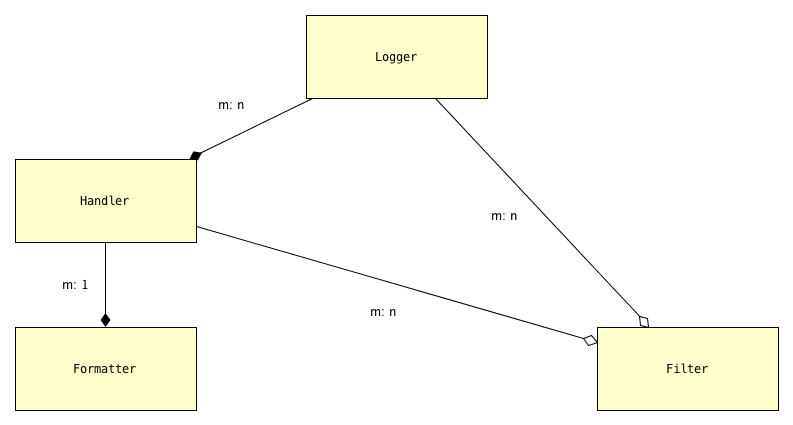
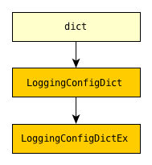

.. _overview:

Overview
===============

Python's `logging` module provides a lot of functionality, exposed by an API which
can seem awkward, complex or confusing. Once a program has configured logging as desired,
use of loggers is generally straightforward. But setting up logging in a desired way often
presents the major hurdle. `lcd` (for **l**\ogging **c**\onfig **d**\ict) provides
a streamlined API for setting up logging, making it easy to use "advanced" features such as
rotating log files. `lcd` also supplies missing functionality: the package provides
multiprocessing-safe logging to the console, to files and to rotating files.

It's not our purpose to rehash or repeat the extensive (and generally quite good)
logging documentation; in fact, we presuppose that you're familiar with basic concepts
and and standard use cases. At the end of this section we provide :ref:`links_to_sections_of_logging_docs`.
Nevertheless, it will be helpful to review a few topics.

Logging a message
-------------------

The `logging`module lets us log messages to various destinations, affording us a lot of
control over what actually gets written where, and when. We use ``Logger``objects to
log messages; ultimately, all the other types defined by `logging` exist only to support
this class.

A ``Logger`` is uniquely identified by name: the expression ``logging.getLogger('mylogger')``,
for example, always denotes the same object, no matter where in a program it occurs or
when it's evaluated.  When evaluated for the first time, the ``Logger`` named ``'mylogger'``
is created "just in time". You don't _have_ to configure ``'mylogger'``; the expression
accessing it will "just work", and then, at least by default, that logger will use the
handlers of it's *parent handler*. The parent of ``'mylogger'`` is the root logger,
``logging.getLogger()``. In many cases, to configure logging it's sufficient just to add
a handler or two to the root.

.. note::

    `logging` supplies reasonable out-of-the-box defaults so that you can easily
    start to use its capabilities. You can just say:

        ``logging.error("Something went wrong")``

    and something plausible will happen (the string will be written to ``stderr``).
    This statement is a shorthand which implicitly uses the "root logger",
    which the `logging` module always creates. By default, the root logger
    writes messages to ``stderr``. All loggers are identified uniquely by name;
    the root logger's name is  ``''``.

    The `logging.basicConfig() <https://docs.python.org/3/library/logging.html#logging.basicConfig>`_
    function lets you configure the root logger, anyway to a point, using
    a monolithic function that's somewhat complex yet of limited capabilities.

    .. todo::
        This makes a lousy "Note", yes?

`logging`-configuration classes
----------------------------------

There are just a few types of entities involved in the configuration of logging.
These classes are all defined in the `logging` module. The following diagram
displays them and their dependencies:

    The objects of `logging` configuration

    +-----------------------+-----------------------+
    | Symbol                | Meaning               |
    +=======================+=======================+
    | .. image:: arrow.png  | has one or more       |
    +-----------------------+-----------------------+
    | .. image:: arrowO.png | has zero or more      |
    +-----------------------+-----------------------+
    | m: 1                  | many-to-one           |
    +-----------------------+-----------------------+
    | m: n                  | many-to-many          |
    +-----------------------+-----------------------+

In words:
    * a ``Logger`` can have one or more ``Handler``\s, and a ``Handler``
      can be used by multiple ``Logger``\s;
    * a ``Handler`` has just one ``Formatter``, but a ``Formatter``
      can be shared by multiple ``Handler``\s;
    * ``Handler``\s and ``Logger``\s can each have zero or more ``Filter``\s.

Review of what these objects do
+++++++++++++++++++++++++++++++++

A ``Formatter`` is basically just an old-style format string using keywords defined by
the `logging` module, such as ``'%(message)s'`` and ``'%(name)-20s: %(levelname)-8s: %(message)s'``.

A ``Handler`` writes logged messages to a particular destination — a stream (e.g.
``sys.stderr``, ``sys.stdout``, or an in-memory stream such as an ``io.StringIO()``),
a file, a rotating set of files, a socket, etc.

A ``Logger``sends logged messages to its associated handlers. Various
criteria filter out which messages are actually written.

Every message that a logger logs has a *level* — a *loglevel*, as we'll call it: an integer
indicating the severity, seriousness or importance of the message. The loglevel is generally
one of the constants ``DEBUG``, ``INFO``, ``WARNING``, ``ERROR``, ``CRITICAL`` defined by the
`logging` module, which we've just listed in order of increasing severity and numeric value.
Every logger has corresponding methods (``debug()``, ``info()`` and so on) for emitting messages
at the named loglevel. As an example, you log a ``WARNING`` message ``"Be careful!"`` to the
logger named ``'mylogger'`` with the statement
``logging.getLogger('mylogger').warning("Be careful!")``.

Every ``Handler`` and every ``Logger`` has a threshold loglevel.

The loglevel of a message must equal or exceed the loglevel of a logger in
order for the logger to send the message to its handlers. In turn, a handler
will write a message only if the message's loglevel also equals or exceeds
that of the handler.

``Filter``\s provide still more fine-grained control over which messages are written.

Order of definition
+++++++++++++++++++++++++++++++++

While configuring logging, you give a name to each of the objects that you define.
When defining a higher-level object, you identify its constituent lower-level objects by name.

``Formatter``\s and ``Filter``\s (if any) don't depend on any other logging objects,
so they should be defined first. Next, define ``Handler``\s, and finally, ``Logger``\s
that use already-defined ``Handler``\s (and, perhaps, ``Filter``\s). `lcd` supplies
dedicated methods for configuring the root logger (setting its level, adding handlers
and filters to it), but often a general-purpose `lcd` method can also be used, by
referring to the root logger by name: ``''``.

.. note::
    Once logging is configured, only the names of ``Logger``\s persist. `logging` retains
    *no associations* between the names you used to specify ``Formatter``, ``Handler`` and
    ``Filter`` objects, and the objects constructed to your specifications; you can't
    access those objects by any name.

Typically, we won't require any ``Filter``\s, and then, setting up logging involves just
these steps:

* define ``Formatter``\s
* define ``Handler``\s that use the ``Formatter``\s
* define ``Logger``\s that use the ``Handler``\s.

In common cases, such as the :ref:`example-overview-config` of the next section, `lcd`
eliminates the first step and makes the last step trivial.

Configuring `logging` with a dict
-----------------------------------

The `logging.config` submodule offers two equivalent ways to specify configuration statically:

* with a dictionary meeting various requirements, which is
  passed to ``logging.config.dictConfig()``;
* with a text file written in YAML, conforming to analogous requirements,
  and passed to ``logging.config.fileConfig()``.

The `schema for configuration dictionaries <https://docs.python.org/3/library/logging.config.html#configuration-dictionary-schema>`_
documents the format of such dictionaries — and uses YAML to do so!, to cut down on
the clutter of quotation marks and curly braces. Arguably, this documentation
makes it seem quite daunting to configure logging with a ``dict``. Following its precepts,
you must create a medium-sized ``dict`` containing several nested ``dict``\s, in which many
values refer back to keys in other sub\``dict``\s — a thicket of curly braces, quotes
and colons, which you finally pass to ``dictConfig()``.

`lcd` defines two classes, ``LoggingConfigDict`` and ``LoggingConfigDictEx``, which
represent logging configuration dictionaries — *logging config dicts*, for short:

You use the methods of these classes to add specifications of named ``Formatter``\s,
``Handler``\s, ``Logger``\s, and optional ``Filter``\s. Once you've done so, calling the
``config()`` method of a ``LoggingConfigDict`` configures logging by passing the object
(itself, as a ``dict``) to ``logging.config.dictConfig()``. This call creates all the
objects and linkages specified by the underlying dictionary.

.. _example-overview-config:

Example
++++++++

Suppose we want the following logging configuration:

    Messages should be logged to both ``stderr`` and a file. Only messages with loglevel
    ``INFO``or higher should appear on-screen, but all messages should be logged to the
    file. Messages to ``stderr``should consist of just the message, but messages
    written to the file should contain the logger name and the message's loglevel.

This suggests two handlers, each with an appropriate formatter — a ``stderr``console
handler with level ``INFO``, and a file handler with level ``DEBUG``. Both handlers
should be attached to the root logger, which must have level ``DEBUG`` (or ``NOTSET``)
to allow all messages through.

Once this configuration is established, these logging calls:

.. code::

    import logging
    root_logger = logging.getLogger()
    root_logger.debug("1. 0 = 0")
    root_logger.info("2. days are getting shorter")
    root_logger.debug("3. 0 != 1")
    # ...
    logging.getLogger('submodule_A').info("4. submodule_A initialized")

should produce the following ``stderr`` output:

.. code::

    2. days are getting shorter
    4. submodule_A initialized

and the logfile should contain (something much like) these lines:

.. code::

    root                : DEBUG   : 1. 0 = 0
    root                : INFO    : 2. days are getting shorter
    root                : DEBUG   : 3. 0 != 1
    submodule_A         : INFO    : 4. submodule_A initialized

Let's see what it's like to set this up — with `lcd`, and without it.

Configuration with `lcd`
~~~~~~~~~~~~~~~~~~~~~~~~~~~~

`lcd` simplifies the creation of "logging config dicts" by breaking the process
down into easy, natural steps. As much as is possible, with `lcd` you only have
to specify the objects you care about and what's special about them; everything
else receives reasonable, expected defaults. Using the "batteries included"
``lcd.LoggingConfigDictEx`` class lets us concisely specify the desired setup:

.. code::

    from lcd import LoggingConfigDictEx

    lcd_ex = LoggingConfigDictEx(root_level='DEBUG',
                                 add_handlers_to_root=True)
    lcd_ex.add_stderr_console_handler(
                    'console',
                    formatter='minimal',
                    level='INFO'
    ).add_file_handler('file_handler',
                       formatter='logger_level_msg',
                       filename='blather.log',
    )

    lcd_ex.config()

Here, we use a couple of the builtin ``Formatter``\s supplied by ``LoggingConfigDictEx``.
Because we pass the flag ``add_handlers_to_root=True`` when creating the instance ``lcd_ex``,
every handler we add to ``lcd_ex`` is automatically added to the root logger.
Later, we'll :ref:`revisit this example <overview-example-using-only-LoggingConfigDict>`,
to see how the same result can be achieved using only ``LoggingConfigDict``.

Remarks
^^^^^^^^^^

To allow chaining, as in the above example, the methods of ``LoggingConfigDict``
and ``LoggingConfigDictEx`` generally return ``self``.

You can use the ``dump()`` method of a ``LoggingConfigDict`` to prettyprint its underlying
``dict``. In fact, that's how we determined the value of ``config_dict`` for the following
subsection.

Configuration without `lcd`
~~~~~~~~~~~~~~~~~~~~~~~~~~~~

Without `lcd`, you could configure logging to satisfy the stated requirements
using code like this:

.. code::

    import logging

    config_dict = \
        {'disable_existing_loggers': False,
         'filters': {},
         'formatters': {'logger_level_msg': {'class': 'logging.Formatter',
                                             'format': '%(name)-20s: %(levelname)-8s: '
                                                       '%(message)s'},
                        'minimal': {'class': 'logging.Formatter',
                                    'format': '%(message)s'}},
         'handlers': {'console': {'class': 'logging.StreamHandler',
                                  'formatter': 'minimal',
                                  'level': 'INFO'},
                      'file_handler': {'class': 'logging.FileHandler',
                                       'delay': False,
                                       'filename': 'blather.log',
                                       'formatter': 'logger_level_msg',
                                       'level': 'DEBUG',
                                       'mode': 'w'}},
         'incremental': False,
         'loggers': {},
         'root': {'handlers': ['console', 'file_handler'], 'level': 'DEBUG'},
         'version': 1}

    logging.config.dictConfig(config_dict)

.. _links_to_sections_of_logging_docs:

Links to sections of the `logging` documentation
----------------------------------------------------

See the `logging docs <https://docs.python.org/3/library/logging.html?highlight=logging>`_
for the official explanation of how logging works.

For the definitive account of static configuration, see the documentation of
`logging.config <https://docs.python.org/3/library/logging.config.html?highlight=logging>`_.

The logging `HOWTO <https://docs.python.org/3/howto/logging.html>`_
contains tutorials that show typical setups and uses of logging, configured in code at runtime.
The `logging Cookbook <https://docs.python.org/3/howto/logging-cookbook.html#logging-cookbook>`_
contains many techniques, several of which go beyond the scope of `lcd` because they involve
`logging` capabilities that can't be configured statically (e.g. the use of
`LoggerAdapters <https://docs.python.org/3/library/logging.html#loggeradapter-objects>`_).

The `logging` module supports multithreaded operation, but does **not** support
`logging to a single file from multiple processes <https://docs.python.org/3/howto/logging-cookbook.html#logging-to-a-single-file-from-multiple-processes>`_.
Happily, `lcd` does.

